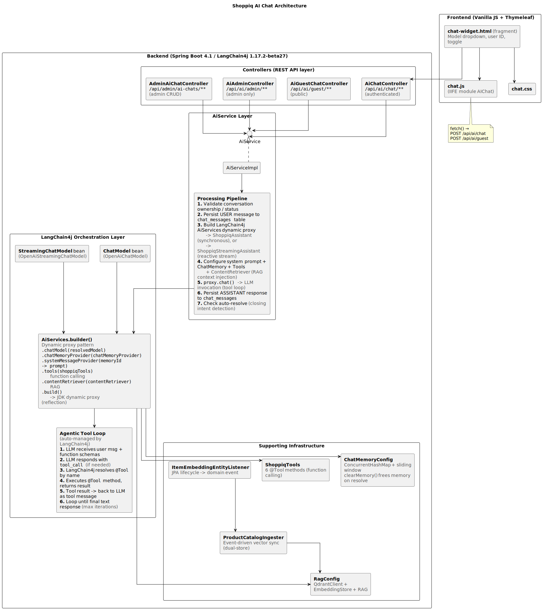

# Shoppiq AI Chat Assistant — Complete Technical Documentation

> **Framework:** LangChain4j 1.17.2-beta27 (Spring Boot 4.1 / Spring Security 7.1 / Java 25)
> **LLM Provider:** NVIDIA NIM (`nvidia/llama-3.3-nemotron-super-49b-v1.5`)
> **Vector Store:** Qdrant (Docker, gRPC on port 6334)
> **Embeddings:** BGE-small-en-v1.5 (384-dim, local ONNX)
> **Profile:** `ai-enabled` (all AI beans gated by `@Profile("ai-enabled")`)

---

## Table of Contents

1. [Architecture Overview](#1-architecture-overview)
2. [Dependencies & Frameworks](#2-dependencies--frameworks)
3. [Package Structure](#3-package-structure)
4. [Database Schema](#4-database-schema)
5. [Configuration](#5-configuration)
6. [Component Wiring & Initialization Flow](#6-component-wiring--initialization-flow)
7. [Authenticated Chat — Full Request Flow](#7-authenticated-chat--full-request-flow)
8. [Guest Chat — Full Request Flow](#8-guest-chat--full-request-flow)
9. [Streaming Chat Flow](#9-streaming-chat-flow)
10. [Tool Calling — How It Works](#10-tool-calling--how-it-works)
11. [RAG Pipeline — Semantic Product Search](#11-rag-pipeline--semantic-product-search)
12. [Chat Memory Management](#12-chat-memory-management)
13. [Dynamic Model Selection](#13-dynamic-model-selection)
14. [Auto-Resolve Detection](#14-auto-resolve-detection)
15. [Conversation Lifecycle](#15-conversation-lifecycle)
16. [Admin Dashboard — Endpoints & Flow](#16-admin-dashboard--endpoints--flow)
17. [Entity Reference](#17-entity-reference)
18. [DTO Reference](#18-dto-reference)
19. [Enum Reference](#19-enum-reference)
20. [Repository Reference](#20-repository-reference)
21. [Exception Handling](#21-exception-handling)
22. [Frontend Integration](#22-frontend-integration)
23. [API Endpoint Reference](#23-api-endpoint-reference)
24. [Security Configuration](#24-security-configuration)
25. [File Reference](#25-file-reference)
26. [AI Keywords & Design Patterns Reference](#26-interview-keywords--design-patterns-reference)

---

## 1. Architecture Overview

The system implements a **retrieval-augmented generation (RAG)** architecture with an **agentic tool-calling loop**, **event-driven vector synchronization**, and **sliding-window conversation memory** — all orchestrated by LangChain4j on top of Spring Boot.


<!-- 
```
┌────────────────────────────────────────────────────────────────────────┐
│  Frontend (Vanilla JS + Thymeleaf)                                     │
│  ┌─────────────┐  ┌──────────┐  ┌───────────────────────────────────┐  │
│  │ chat.js     │  │ chat.css │  │ chat-widget.html (fragment)       │  │
│  │ (IIFE module│  │          │  │ Model dropdown, user ID, toggle   │  │
│  │  AIChat)    │  │          │  │                                   │  │
│  └──────┬──────┘  └──────────┘  └───────────────────────────────────┘  │
│         │ fetch() ➡️ POST /api/ai/chat, /api/ai/guest                  │
├─────────┼──────────────────────────────────────────────────────────────┤
│  Backend (Spring Boot 4.1 / LangChain4j 1.17.2-beta27)                 │
│  ┌──────▼────────────────────────────────────────────────────────┐     │
│  │ Controllers (REST API layer)                                  │     │
│  │  AiChatController      /api/ai/chat/**      (authenticated)   │     │
│  │  AiGuestChatController /api/ai/guest/**     (public)          │     │
│  │  AiAdminController     /api/ai/admin/**     (admin only)      │     │
│  │  AdminAiChatController /api/admin/ai-chats/** (admin CRUD)    │     │
│  └──────┬────────────────────────────────────────────────────────┘     │
│         │                                                              │
│  ┌──────▼────────────────────────────────────────────────────────┐     │
│  │ ChatService (interface) ➡️ ChatServiceImpl                    │     │
│  │  ┌──────────────────────────────────────────────────────┐     │     │
│  │  │ 1. Validate conversation ownership / status          │     │     │
│  │  │ 2. Persist USER message to chat_messages table       │     │     │
│  │  │ 3. Build LangChain4j AiServices dynamic proxy        │     │     │
│  │  │    - ShoppiqAssistant (synchronous) or               │     │     │
│  │  │    - ShoppiqStreamingAssistant (reactive stream)     │     │     │
│  │  │ 4. System prompt engineering + ChatMemory + Tools    │     │     │
│  │  │    + ContentRetriever (RAG context injection)        │     │     │
│  │  │ 5. proxy.chat() ➡️ LLM invocation (tool loop)        │     │     │
│  │  │ 6. Persist ASSISTANT response to chat_messages       │     │     │
│  │  │ 7. Check auto-resolve (closing intent detection)     │     │     │
│  │  └──────────────────────────────────────────────────────┘     │     │
│  └──────┬────────────────────────────────────────────────────────┘     │
│         │                                                              │
│  ┌──────▼────────────────────────────────────────────────────────┐     │
│  │ LangChain4j Orchestration Layer                               │     │
│  │  ┌──────────────────┐  ┌──────────────────────────────────┐   │     │
│  │  │ ChatModel bean   │  │ StreamingChatModel bean          │   │     │
│  │  │ (OpenAiChatModel)│  │ (OpenAiStreamingChatModel)       │   │     │
│  │  └───────┬──────────┘  └──────────────┬───────────────────┘   │     │
│  │          │                            │                       │     │
│  │  ┌───────▼────────────────────────────▼───────────────────┐   │     │
│  │  │  AiServices.builder()  ⬅️ Dynamic proxy pattern         │   │     │
│  │  │    .chatModel(resolvedModel)                           │   │     │
│  │  │    .chatMemoryProvider(chatMemoryProvider)             │   │     │
│  │  │    .systemMessageProvider(memoryId -> prompt)          │   │     │
│  │  │    .tools(shoppiqTools)          ⬅️ function calling    │   │     │
│  │  │    .contentRetriever(contentRetriever) ⬅️ RAG           │   │     │
│  │  │    .build()  ➡️ JDK dynamic proxy (reflection)         │   │     │
│  │  └────────────────────────────────────────────────────────┘   │     │
│  │          │                                                    │     │
│  │  ┌───────▼──────────────────────────────────────────────┐     │     │
│  │  │  Agentic Tool Loop (auto-managed by LangChain4j):    │     │     │
│  │  │   1. LLM receives user msg + function schemas        │     │     │
│  │  │   2. LLM responds with tool_call (if needed)         │     │     │
│  │  │   3. LangChain4j resolves @Tool by name              │     │     │
│  │  │   4. Executes @Tool method, returns result           │     │     │
│  │  │   5. Tool result ➡️ back to LLM as tool message      │     │     │
│  │  │   6. Loop until final text response (max iterations) │     │     │
│  │  └──────────────────────────────────────────────────────┘     │     │
│  └───────────────────────────────────────────────────────────────┘     │
│         │                                                              │
│  ┌──────▼──────────────────────────────────────────────────────────┐   │
│  │ Supporting Infrastructure                                       │   │
│  │  ChatMemoryConfig   ➡️ ConcurrentHashMap + sliding window       │   │
│  │                     ➡️ clearMemory() frees memory on resolve    │   │
│  │  RagConfig          ➡️ QdrantClient + EmbeddingStore + RAG      │   │
│  │  ShoppiqTools       ➡️ 6 @Tool methods (function calling)       │   │
│  │  ProductCatalogIngester ➡️ Event-driven vector sync (dual-store)│   │
│  │  ItemEmbeddingEntityListener ➡️ JPA lifecycle ➡️ domain event   │   │
│  └─────────────────────────────────────────────────────────────────┘   │
└────────────────────────────────────────────────────────────────────────┘
```
-->

### Key Architectural Patterns

| Pattern | Implementation | AI Term |
|---------|---------------|----------------|
| **Agentic workflow** | LLM autonomously selects and calls tools in a loop | Agent loop, function calling, tool use |
| **Retrieval-Augmented Generation** | ContentRetriever injects top-k product chunks into LLM prompt | RAG, semantic retrieval, context injection |
| **Sliding-window memory** | MessageWindowChatMemory with 20-message cap | Conversation memory, context window management |
| **Event-driven sync** | JPA EntityListener ► Spring ApplicationEvent ► TransactionalEventListener | Domain events, event-driven architecture |
| **Dynamic proxy** | AiServices.builder().build() returns JDK proxy | Dynamic proxy pattern, reflection-based dispatch |
| **Lazy initialization** | Model cache uses ConcurrentHashMap.computeIfAbsent | Lazy loading, caching strategy |
| **Graceful degradation** | Null-check on chatService ► 503 SERVICE_UNAVAILABLE | Fail-open, dependency check |
| **Idempotent operations** | Resolve is no-op if already resolved | Idempotency, safe retries |

---

## 2. Dependencies & Frameworks

All dependencies declared in `pom.xml`:

| Dependency | Version | Purpose |
|-----------|---------|---------|
| `langchain4j-spring-boot4-starter` | 1.17.2-beta27 | Core LangChain4j integration (AiServices, ChatMemory, RAG) |
| `langchain4j-open-ai-spring-boot4-starter` | 1.17.2-beta27 | OpenAI-compatible ChatModel/StreamingChatModel (used for NVIDIA NIM) |
| `langchain4j-reactor` | 1.17.2-beta27 | `Flux<String>` streaming support via Project Reactor |
| `langchain4j-qdrant` | 1.17.2-beta27 | `QdrantEmbeddingStore` — vector store for RAG |
| `langchain4j-embeddings-bge-small-en-v15` | 1.12.0-beta20 | Local BGE-small-en-v1.5 ONNX embedding model (384-dim) |
| `onnxruntime` | 1.26.0 | ONNX runtime for local embedding inference (overrides transitive) |

**Runtime Infrastructure:**
- **Qdrant** — Docker container (`qdrant/qdrant:v1.13.0`), gRPC on port 6334, REST on 6333
- **MySQL** — Local instance, tables created via Flyway migration `V30__create_ai_chat_tables.sql`

---

## 3. Package Structure

All AI service code lives under `com.pkmprojects.shoppiq.aiservice`:

```
com.pkmprojects.shoppiq.aiservice/
├── config/
│   ├── ChatServiceConfig.java                 @Configuration @Profile("ai-enabled")
│   │                                          Creates ChatModel, StreamingChatModel, ChatService beans
│   ├── ChatMemoryConfig.java                  @Configuration (public)
│   │                                          Provides ChatMemoryProvider with ConcurrentHashMap cache
│   │                                          clearMemory(chatId) removes cached memory on resolve
│   └── RagConfig.java                         @Configuration @Profile("ai-enabled")
│                                              QdrantClient, EmbeddingStore, EmbeddingModel, ContentRetriever
├── controller/
│   ├── AiChatController.java                  @RestController /api/ai/chat/** (authenticated)
│   ├── AiGuestChatController.java             @RestController /api/ai/guest/** (public)
│   └── AiAdminController.java                 @RestController /api/ai/admin/** (admin only)
├── dto/
│   ├── ChatRequest.java                       record(message, chatId, model)
│   ├── ChatResponse.java                      record(chatId, messages)
│   ├── ChatMessageDto.java                    record(id, role, content, toolName, createdAt)
│   ├── ConversationSummary.java               record(chatId, title, status, messageCount, createdAt, lastMessageAt)
│   └── admin/
│       ├── AiChatLogDto.java                  record(chatId, userId, userName, userEmail, title, status, messageCount, createdAt, lastActivityAt)
│       └── AiChatLogDetailDto.java            record(chatId, userId, userName, userEmail, title, status, createdAt, resolvedAt, messages)
├── entity/
│   ├── ChatConversation.java                  @Entity — chat_conversations table
│   └── ChatMessage.java                       @Entity — chat_messages table
├── enums/
│   ├── ChatMessageRole.java                   USER, ASSISTANT, SYSTEM, TOOL
│   └── ConversationStatus.java                ACTIVE, RESOLVED
├── events/
│   ├── ApplicationEventPublisherHolder.java   Static holder for Spring ApplicationEventPublisher
│   ├── ItemEmbeddingEntityListener.java       @PostPersist @PostUpdate @PreRemove on Item
│   └── ProductEmbeddingEvent.java             DTO event carrying product data for vector sync
├── exception/
│   └── AiAssistantException.java              Extends ShoppiqException — AI-specific errors
├── ingestion/
│   └── ProductCatalogIngester.java            @Component — CommandLineRunner + @TransactionalEventListener
│                                              Maintains Qdrant vector store sync with product catalog
├── repository/   
│   ├── ChatConversationRepository.java        JpaRepository — conversation CRUD + search
│   └── ChatMessageRepository.java             JpaRepository — message CRUD + batch counting
├── service/
│   ├── ChatService.java                       Interface — all chat/resolve/history methods
│   ├── ChatServiceImpl.java                   Implementation — LangChain4j proxy builder + persistence
│   ├── ShoppiqAssistant.java                  LangChain4j service interface (sync, @MemoryId routing)
│   └── ShoppiqStreamingAssistant.java         LangChain4j service interface (streaming, Flux<String>)
└── tools/
    └── ShoppiqTools.java                      @Component @Profile("ai-enabled") — 6 @Tool methods
```

**Additional files outside `aiservice` package:**

| File | Path | Purpose |
|------|------|---------|
| `AdminAiChatController.java` | `controller/admin/` | Admin CRUD for conversations (list, detail, delete, resolve) |
| `AiConversationNotFoundException.java` | `exception/` | 404 exception for missing conversations |
| `V30__create_ai_chat_tables.sql` | `db/migration/` | Flyway migration for chat_conversations + chat_messages |
| `chat-widget.html` | `templates/fragments/` | Thymeleaf fragment — floating chat widget |
| `chat.js` | `static/js/` | IIFE module `window.AIChat` — chat widget logic |
| `chat.css` | `static/css/` | Chat widget styles |
| `admin-ai-chats.html` | `templates/` | Admin conversation list page |
| `admin-ai-chat-detail.html` | `templates/` | Admin conversation detail page |

---

## 4. Database Schema

### Flyway Migration: `V30__create_ai_chat_tables.sql`

**Table: `chat_conversations`**

| Column | Type | Nullable | Description |
|--------|------|----------|-------------|
| `id` | BIGINT AUTO_INCREMENT | No | Primary key (from `AuditableEntity`) |
| `version` | BIGINT | No | Optimistic locking version |
| `created_at` | TIMESTAMP | No | Creation timestamp |
| `updated_at` | TIMESTAMP | No | Last update timestamp |
| `user_id` | BIGINT | Yes | FK ➡️ `users.id` (NULL for guests) |
| `chat_id` | VARCHAR(20) | No | Public ID, e.g. `CHAT-2026-07-A3F2` (unique) |
| `title` | VARCHAR(255) | No | Auto-generated from first user message |
| `status` | VARCHAR(16) | No | `ACTIVE` or `RESOLVED` |
| `resolved_at` | TIMESTAMP | Yes | When conversation was resolved |
| `guest_session` | VARCHAR(64) | Yes | Guest session UUID |
| `guest_ip` | VARCHAR(45) | Yes | Guest IP address |

**Table: `chat_messages`**

| Column | Type | Nullable | Description |
|--------|------|----------|-------------|
| `id` | BIGINT AUTO_INCREMENT | No | Primary key (from `AuditableEntity`) |
| `version` | BIGINT | No | Optimistic locking version |
| `created_at` | TIMESTAMP | No | Creation timestamp |
| `updated_at` | TIMESTAMP | No | Last update timestamp |
| `conversation_id` | BIGINT | No | FK ➡️ `chat_conversations.id` (CASCADE DELETE) |
| `role` | VARCHAR(16) | No | `USER`, `ASSISTANT`, `SYSTEM`, `TOOL` |
| `content` | TEXT | No | Full message text |
| `tool_name` | VARCHAR(128) | Yes | Tool that produced this message |
| `tokens_used` | INT | Yes | Token count for cost tracking |

**Indexes:**
- `idx_chat_conv_chat_id` — UNIQUE on `chat_id`
- `idx_chat_conv_user_id` — on `user_id`
- `idx_chat_conv_guest_session` — on `guest_session`
- `idx_chat_conv_status` — on `status`
- `idx_chat_msg_conv_id` — on `conversation_id`
- `idx_chat_msg_role` — on `role`

**Relationships:**
```
User (1) ──── (*) ChatConversation (*) ──── (*) ChatMessage
                  │                             │
                  ├─ id (PK)                    ├─ id (PK)
                  ├─ chatId (unique)            ├─ role (enum)
                  ├─ title                      ├─ content (TEXT)
                  ├─ status (enum)              ├─ toolName (nullable)
                  ├─ resolvedAt (nullable)      └─ tokensUsed (nullable)
                  ├─ guestSession (nullable)
                  └─ guestIp (nullable)
```

---

## 5. Configuration

### `application.yaml` — AI Section

```yaml
spring:
  profiles:
    active: ${SPRING_PROFILES_ACTIVE:default,ai-enabled}

shoppiq:
  ai:
    enabled: ${SHOPPIQ_AI_ENABLED:false}
    resolve-threshold: 3          # Messages before auto-resolve triggers
    rag:
      max-results: 5              # Top-k product chunks per query
      min-score: 0.75             # Cosine similarity threshold
      reindex-on-startup: false   # Full reindex on boot (events handle incremental)

langchain4j:
  open-ai:
    chat-model:
      api-key: ${NVIDIA_API_KEY}
      base-url: https://integrate.api.nvidia.com/v1
      model-name: nvidia/llama-3.3-nemotron-super-49b-v1.5
      max-tokens: 4096
      log-requests: true
      log-responses: true
    streaming-chat-model:
      api-key: ${NVIDIA_API_KEY}
      base-url: https://integrate.api.nvidia.com/v1
      model-name: nvidia/llama-3.3-nemotron-super-49b-v1.5
      max-tokens: 4096
      log-requests: true
      log-responses: true
  qdrant:
    host: ${QDRANT_HOST:localhost}
    port: ${QDRANT_PORT:6334}
    collection-name: ${QDRANT_COLLECTION:shoppiq_products}
```

### Environment Variables

| Variable | Required | Description |
|----------|----------|-------------|
| `NVIDIA_API_KEY` | Yes | NVIDIA NIM API key for LLM calls |
| `QDRANT_HOST` | No | Qdrant host (default: `localhost`) |
| `QDRANT_PORT` | No | Qdrant gRPC port (default: `6334`) |
| `QDRANT_COLLECTION` | No | Vector collection name (default: `shoppiq_products`) |
| `SHOPPIQ_AI_ENABLED` | No | Enable AI beans (default: `false`) |

---

## 6. Component Wiring & Initialization Flow

### Startup Sequence

When the `ai-enabled` profile is active, Spring Boot creates the following beans in order:

```
1. ChatMemoryConfig.chatMemoryProvider()
   ► Returns ChatMemoryProvider (lambda: computeIfAbsent on ConcurrentHashMap)
   ► Each chatId gets a MessageWindowChatMemory with maxMessages=20

2. RagConfig.qdrantClient()
   ► Creates QdrantClient connecting to Qdrant gRPC endpoint

3. RagConfig.embeddingModel()
   ► Creates BgeSmallEnV15EmbeddingModel (local ONNX, 384-dim)

4. RagConfig.embeddingStore()
   ► Calls ensureCollectionExists() to create Qdrant collection if missing
   ► Returns QdrantEmbeddingStore (collection=shoppiq_products)

5. RagConfig.contentRetriever()
   ► Returns EmbeddingStoreContentRetriever
   ► Config: maxResults=5, minScore=0.75, filter=inStock:"true"

6. ChatServiceConfig.chatModel()
   ► Creates OpenAiChatModel (NVIDIA NIM, nvidia/llama-3.3-nemotron-super-49b-v1.5)

7. ChatServiceConfig.streamingChatModel()
   ► Creates OpenAiStreamingChatModel (same model, streaming variant)

8. ShoppiqTools (auto-detected @Component)
   ► Injects: ItemRepository, ChatConversationRepository, ChatMessageRepository,
     ChatMemoryConfig, OrderRepository, CartService, ItemReviewRepository,
     EmbeddingStore, EmbeddingModel

9. ChatServiceConfig.chatService()
   ► Creates ChatServiceImpl (manual constructor injection)
   ► Injects: chatModel, streamingChatModel, chatMemoryProvider, chatMemoryConfig,
     shoppiqTools, contentRetriever, conversationRepository, messageRepository,
     userRepository, nvidiaApiKey

10. ProductCatalogIngester (auto-detected @Component)
    ► Implements CommandLineRunner: checks if Qdrant store is empty ➡️ reindexAll()
    ► @TransactionalEventListener: reacts to ProductEmbeddingEvent for incremental sync

11. ItemEmbeddingEntityListener (registered on Item entity)
    ► @PostPersist/@PostUpdate: publishes ProductEmbeddingEvent
    ► @PreRemove: publishes deletion event
```

### `ChatServiceImpl` Constructor

```java
public ChatServiceImpl(
    ChatModel chatModel,                                // Default synchronous model (Nemotron 49B)
    StreamingChatModel streamingChatModel,              // Default streaming model (Nemotron 49B)
    ChatMemoryProvider chatMemoryProvider,              // Per-conversation memory windows
    ChatMemoryConfig chatMemoryConfig,                  // Memory lifecycle (clear on resolve)
    ShoppiqTools shoppiqTools,                          // 6 @Tool methods
    ContentRetriever contentRetriever,                  // RAG: retrieves relevant product chunks
    ChatConversationRepository conversationRepository,
    ChatMessageRepository messageRepository,
    UserRepository userRepository,
    String nvidiaApiKey                                 // For dynamic model creation
)
```

---

## 7. Authenticated Chat — Full Request Flow

### Step-by-step: `POST /api/ai/chat` (create new conversation)

```
1. AiChatController.createAndChat()
   ├── @AuthenticationPrincipal User user ➡️ injected by Spring Security JWT filter
   ├── @Valid @RequestBody ChatRequest request ➡️ { message: "find running shoes", model: "..." }
   └── null check: chatService == null ➡️ 503 SERVICE_UNAVAILABLE

2. chatService.createConversation(user)
   ├── generateChatId() ➡️ "CHAT-2026-07-A3F2"
   │   ├── prefix = "CHAT-" + YearMonth.now().format("yyyy-MM")
   │   ├── suffix = UUID.randomUUID().substring(0,4).toUpperCase()
   │   └── loop until !existsByChatId(fullId)
   ├── ChatConversation.builder()
   │   .user(user).chatId(chatId).title("New Conversation").status(ACTIVE)
   └── conversationRepository.save(conv) ➡️ persists to chat_conversations

3. chatService.chat(request.message(), conv.getChatId(), user, request.model())
   ├── a. resolveConversationEntity(chatId, user)
   │   ├── conversationRepository.findByChatId(chatId) ➡️ throw if not found
   │   └── validate: conv.getUser().getId().equals(user.getId()) ➡️ throw if not owner
   │
   ├── b. checkResolved(conv)
   │   └── conv.getStatus() == RESOLVED ➡️ throw AiAssistantException.conversationResolved() (410)
   │
   ├── c. saveMessage(conv, USER, userMessage)
   │   └── messageRepository.save(ChatMessage.builder()
   │       .conversation(conv).role(USER).content(userMessage).build())
   │
   ├── d. updateTitleFromFirstMessage(conv, userMessage)
   │   └── if title == "New Conversation" ➡️ title = first 50 chars of message + "..."
   │
   ├── e. buildSystemPrompt(chatId, user)
   │   └── Returns prompt with user identity, tool instructions, chat ID, guidelines
   │
   ├── f. resolveChatModel(model)
   │   ├── if model is null/blank ➡️ return default chatModel bean
   │   └── else ➡️ chatModelCache.computeIfAbsent(model, name ➡️ OpenAiChatModel.builder()...)
   │
   ├── g. Build LangChain4j proxy:
   │   AiServices.builder(ShoppiqAssistant.class)
   │       .chatModel(resolvedModel)
   │       .chatMemoryProvider(chatMemoryProvider)
   │       .systemMessageProvider(memoryId -> systemPrompt)
   │       .tools(shoppiqTools)
   │       .contentRetriever(contentRetriever)
   │       .build()
   │
   ├── h. proxy.chat(userMessage, chatId)
   │   ├── LangChain4j sends userMessage + system prompt + tool definitions to LLM
   │   ├── LLM may respond with tool_call ➡️ LangChain4j executes @Tool method ➡️ sends result back
   │   ├── Loop continues until LLM produces final text response
   │   └── Returns final response string
   │
   ├── i. saveMessage(conv, ASSISTANT, response)
   │
   └── j. shouldAutoResolve(userMessage, conv)
       ├── countByConversationIdAndRole(conv.getId(), USER) < resolveThreshold(3) ➡️ false
       └── match closing phrases ("thanks", "bye", "done", etc.) ➡️ resolveConversation()
           ➡️ Sets RESOLVED, saves SYSTEM message, clears chat memory

4. chatService.getMessages(conv.getChatId(), user)
   └── messageRepository.findByConversationIdOrderByCreatedAtAsc(conv.getId())
       ➡️ map to ChatMessageDto(id, role, content, toolName, createdAt)

5. Return ResponseEntity.ok(ChatResponse(conv.getChatId(), messages))
```

### Step-by-step: `POST /api/ai/chat/{chatId}` (existing conversation)

Same as steps 2-5 above, except `createConversation()` is skipped — the `chatId` path variable is used directly.

---

## 8. Guest Chat — Full Request Flow

### Step-by-step: `POST /api/ai/guest`

```
1. AiGuestChatController.guestChat()
   ├── @RequestBody @Valid ChatRequest request ➡️ { message: "...", model: "..." }
   ├── @CookieValue("GUEST_SESSION") sessionId ➡️ null if first visit
   ├── chatService == null ➡️ 503
   │
   ├── Generate session if new:
   │   ├── sessionId = UUID.randomUUID().toString()
   │   └── Set GUEST_SESSION cookie: HttpOnly, path=/, maxAge=24h
   │
   ├── chatService.guestChat(request.message(), sessionId, request.model())
   │   ├── saveGuestMessage(sessionId, "USER", userMessage)
   │   │   └── guestMessageStore.computeIfAbsent(sessionId, k ➡️ synchronizedList(new ArrayList<>()))
   │   │       .add(new GuestMessage("USER", userMessage, Instant.now()))
   │   │
   │   ├── buildGuestSystemPrompt() ➡️ limited prompt (no order/cart/review tools)
   │   │
   │   ├── resolveChatModel(model) ➡️ default or dynamic model
   │   │
   │   ├── Build proxy (NO .tools()):
   │   │   AiServices.builder(ShoppiqAssistant.class)
   │   │       .chatModel(resolvedModel)
   │   │       .chatMemoryProvider(chatMemoryProvider)
   │   │       .systemMessageProvider(memoryId -> guestPrompt)
   │   │       .contentRetriever(contentRetriever)  ⬅️ RAG still works
   │   │       .build()
   │   │
   │   ├── chatId = "guest-" + sessionId (for memory routing)
   │   ├── proxy.chat(userMessage, chatId) ➡️ LLM response
   │   │
   │   ├── saveGuestMessage(sessionId, "ASSISTANT", response)
   │   └── return response
   │
   └── Return: { "response": aiResponse, "sessionId": sessionId }

2. Guest messages are stored IN-MEMORY ONLY (ConcurrentHashMap)
   ► Not persisted to MySQL
   ► Lost on JVM restart
   ► getGuestMessages() reads from memory
   ► resolveGuestConversation() clears the session from memory
```

**Key difference from authenticated chat:**
- No `.tools()` on the proxy ➡️ LLM cannot call order/cart/review tools
- Messages stored in `guestMessageStore` (in-memory), not `chat_messages` table
- Memory ID uses `"guest-" + sessionId` prefix
- RAG content retriever is still attached ➡️ product search works

---

## 9. Streaming Chat Flow

### Overview

The system supports **token-by-token streaming** via **Server-Sent Events (SSE)** using **Project Reactor's `Flux<String>`**. This enables **progressive rendering** on the frontend — the user sees the LLM response as it's generated, rather than waiting for the complete response.

### Current Implementation

The current frontend uses **non-streaming** responses via `POST /api/ai/chat` and `POST /api/ai/guest`. The frontend `chat.js` sends a standard POST and receives a JSON response.

### Streaming Architecture (Available but Not Active)

```
User ► POST /api/ai/chat ► ChatServiceImpl.chatStream()
  │
  ▼
ShoppiqStreamingAssistant.chat(userMessage, chatId)
  │
  ▼
Flux<String> (reactive stream of tokens)
  │
  ├── .doOnNext(token ► fullResponse.append(token))
  │     ► Token accumulation for DB persistence
  │
  ├── .doOnComplete(() ► {
  │     ► saveMessage(conv, ASSISTANT, fullResponse.toString())
  │     ► shouldAutoResolve() check
  │   })
  │
  └── .doOnError(error ► {
        ► log.error(...)
        ► saveMessage(conv, ASSISTANT, "I'm sorry, an error occurred...")
      })
```

The streaming proxy is built with `.streamingChatModel()` (not `.chatModel()`):

```java
AiServices.builder(ShoppiqStreamingAssistant.class)
    .streamingChatModel(resolvedStreamingModel)
    .chatMemoryProvider(chatMemoryProvider)
    .systemMessageProvider(memoryId -> systemPrompt)
    .tools(shoppiqTools)
    .contentRetriever(contentRetriever)
    .build();
```

### Key Concepts

| Concept | Implementation | AI Term |
|---------|---------------|----------------|
| **Token-by-token streaming** | `Flux<String>` from LangChain4j Reactor | SSE, progressive rendering |
| **Reactive streams** | Project Reactor `Flux<T>` | Backpressure, non-blocking I/O |
| **Operator chaining** | `.doOnNext()`, `.doOnComplete()`, `.doOnError()` | RxJava-style operators, stream processing |
| **Token accumulation** | `StringBuilder` collects tokens on `doOnNext` | Stream aggregation, stateful processing |
| **Error handling** | `doOnError` saves fallback message | Graceful degradation, error recovery |
| **OpenAI SSE protocol** | NVIDIA NIM returns SSE tokens | Server-Sent Events, streaming inference |

### Streaming vs. Non-Streaming

| Aspect | Non-Streaming (current) | Streaming (available) |
|--------|------------------------|----------------------|
| **Response time** | Wait for full response | Progressive tokens |
| **User experience** | Loading spinner ➡️ full text | Typewriter effect |
| **Implementation** | `proxy.chat()` ➡️ `String` | `proxy.chat()` ➡️ `Flux<String>` |
| **DB persistence** | After complete response | On `doOnComplete` |
| **Error handling** | Try-catch | `doOnError` operator |
| **Frontend** | Standard fetch | EventSource / SSE |

### Dependencies

| Dependency | Purpose | AI Term |
|-----------|---------|----------------|
| `langchain4j-reactor` | `Flux<String>` streaming support | Reactive streams, Project Reactor |
| `OpenAiStreamingChatModel` | SSE token streaming from NVIDIA NIM | Streaming inference, SSE protocol |
| `ShoppiqStreamingAssistant` | LangChain4j streaming interface | Reactive assistant pattern |

---

## 10. Tool Calling — How It Works

### Overview

Tool calling (also called **function calling**) enables the LLM to autonomously invoke external functions during inference. This transforms the LLM from a text generator into an **agentic system** that can reason, plan, and execute actions. LangChain4j manages the entire **tool loop** — the LLM decides when to call a tool, LangChain4j executes it, and the result is fed back to the LLM for further reasoning.

### Tool Registration

`ShoppiqTools` is a `@Component` with 6 `@Tool`-annotated methods. LangChain4j auto-discovers them and sends their **function schemas** (JSON Schema) to the LLM as part of the prompt. The LLM uses these schemas to decide which tool to call and with what arguments.

### The 6 Tools

| Tool Method | Description | Parameters | AI Term |
|-------------|-------------|------------|----------------|
| `getProductDetail` | Product info by slug or name | `identifier: String` | Entity lookup, grounding |
| `getOrderStatus` | User's recent orders or specific order | `orderNumber: String (nullable)`, `limit: Integer (nullable)` | Stateful tool, user context |
| `getCartContents` | User's shopping cart | (none — uses `@ToolMemoryId`) | Implicit context injection |
| `getUserReviews` | User's product reviews | `limit: Integer (nullable)` | User history retrieval |
| `semanticProductSearch` | Vector/semantic product search | `query: String`, `category: String (nullable)`, `maxPrice: Double (nullable)`, `limit: Integer (nullable)` | RAG tool, hybrid search |
| `resolveCurrentConversation` | Resolve (close) the current conversation | (none — uses `@ToolMemoryId`) | State mutation, lifecycle control |

### Agentic Tool Loop

```
1. System prompt sent to LLM includes function schemas (JSON Schema per tool)
2. User sends: "What's in my cart?"
3. LLM responds with: { tool_call: "getCartContents", arguments: {} }
4. LangChain4j intercepts tool_call:
   a. Looks up @Tool method by name (reflection-based dispatch)
   b. Resolves @ToolMemoryId ➡️ chatId ➡️ resolves user via ChatConversationRepository
   c. Executes getCartContents(chatId) via Java reflection
   d. Returns tool result string
5. Tool result sent back to LLM as tool message
6. LLM generates final response: "Your cart has 3 items, subtotal: $149.97..."
7. Final response returned to controller
```

**Key interview concepts:**
- **Function schema**: JSON Schema describing tool name, parameters, types — sent to LLM
- **Tool dispatch**: LangChain4j matches LLM's `tool_call` to `@Tool` method by name
- **Agentic loop**: LLM ➡️ tool_call ➡️ execute ➡️ tool_result ➡️ LLM ➡️ ... ➡️ final response
- **Max iterations**: Safety limit prevents infinite tool loops
- **Tool result persistence**: TOOL role exists in schema but not persisted by application code

### Tool Memory ID Resolution

Each tool method that needs user context has `@ToolMemoryId String chatId`:

```java
@Tool("Get the user's current shopping cart contents...")
public String getCartContents(@ToolMemoryId String chatId) {
    User user = resolveUser(chatId);  // chatId ➡️ conversation ➡️ user
    // ... use user to look up cart
}
```

**`@ToolMemoryId`** is a LangChain4j annotation that injects the conversation's memory ID into the tool method. This provides **implicit context injection** — the tool doesn't need the user ID explicitly; it's derived from the conversation.

`resolveUser()` internally calls:
```java
conversationRepository.findByChatId(chatId)
    .map(conv -> {
        if (conv.getUser() == null) throw AiAssistantException.apiError("...");
        return conv.getUser();
    })
    .orElseThrow(() -> AiConversationNotFoundException.chatId(chatId));
```

### Guest Tool Access — Role-Based Tool Filtering

Guests have **no tool access**. The proxy is built without `.tools()`:

```java
AiServices.builder(ShoppiqAssistant.class)
    .chatModel(resolvedModel)
    .chatMemoryProvider(chatMemoryProvider)
    .systemMessageProvider(memoryId -> guestPrompt)
    .contentRetriever(contentRetriever)  // RAG still works
    .build();  // NO .tools() call
```

**AI term:** This is **role-based tool access control** — the same LLM proxy is configured differently based on the caller's role. Guests get RAG (context enrichment) but not tools (action execution).

### `resolveCurrentConversation` Tool — Autonomous State Mutation

The AI can主动 resolve a conversation when the user indicates they're done (e.g., "thanks", "bye", "that's all"):

```java
@Tool("Resolve (close) the current conversation...")
public String resolveCurrentConversation(@ToolMemoryId String chatId) {
    User user = resolveUser(chatId);
    ChatConversation conv = conversationRepository.findByChatId(chatId)...;

    // Ownership validation (security)
    if (conv.getUser() == null || !conv.getUser().getId().equals(user.getId())) {
        throw AiAssistantException.apiError("You do not have access to this conversation.");
    }

    // Idempotent — skip if already resolved (safe retries)
    if (conv.getStatus() == ConversationStatus.RESOLVED) {
        return "This conversation is already resolved.";
    }

    // Resolve: set status, timestamp, SYSTEM message, clear memory
    conv.setStatus(ConversationStatus.RESOLVED);
    conv.setResolvedAt(Instant.now());
    conversationRepository.save(conv);
    messageRepository.save(ChatMessage.builder()...build());
    chatMemoryConfig.clearMemory(chatId);

    return "Conversation resolved. Thank you for chatting with Shoppiq!";
}
```

**Key behaviors:**
- **Ownership validation**: Security check before state mutation
- **Idempotent**: Returns early if already resolved — safe for retries and duplicate calls
- **Memory lifecycle**: Clears in-memory LangChain4j chat memory after resolving
- **State machine**: ACTIVE ➡️ RESOLVED (irreversible)

---

## 11. RAG Pipeline — Semantic Product Search

### How RAG Works

**Retrieval-Augmented Generation (RAG)** augments the LLM's knowledge by injecting relevant product information into the context window before each response — without fine-tuning or retraining the model. This is a **context enrichment** pattern that grounds LLM responses in factual, up-to-date product data.

### Pipeline Overview

```
User Query ► Embedding ► Vector Similarity Search ► Top-K Retrieval ► Context Injection ► LLM Response
     │              │                │                      │                    │
     │         384-dim vector    Cosine similarity       maxResults=5        System prompt
     │         (local BGE)       + metadata filter     minScore=0.75       includes chunks
     │                                                                           │
     └───────────────────────────────────────────────────────────────────────────┘
```

### Step-by-Step Flow

```
1. User sends message: "I need comfortable running shoes under $100"
2. ContentRetriever (EmbeddingStoreContentRetriever) activates:
   a. EmbeddingModel.embed(query)            ➡️ 384-dim query vector (local ONNX inference)
   b. EmbeddingStore.search(
        queryEmbedding,
        maxResults=5,                        ⬅️ top-k retrieval
        minScore=0.75,                       ⬅️ similarity threshold (cosine)
        filter=IsEqualTo("inStock", "true")  ⬅️ metadata filtering
      )
   c. Returns top-5 matching product TextSegments with metadata
3. LangChain4j injects retrieved context into the prompt (before system message)
4. LLM receives: [retrieved product chunks] + [system prompt] + [user message]
5. LLM can reference real product names, prices, slugs in its response
```

### Embedding Model — Local Inference

| Property | Value | AI Term |
|----------|-------|----------------|
| Model | BGE-small-en-v1.5 | Sentence transformer, bi-encoder |
| Dimensions | 384 | Vector dimensionality, embedding space |
| Runtime | ONNX Runtime 1.26.0 | Local inference, edge deployment |
| API calls | None (fully local) | Cost optimization, latency reduction |
| Interface | `EmbeddingModel` (LangChain4j) | Embedding abstraction layer |

```java
@Bean
EmbeddingModel embeddingModel() {
    return new BgeSmallEnV15EmbeddingModel();  // Local ONNX, no external API
}
```

**Why local embeddings:** Eliminates API latency (~50ms per embed call) and cost ($0.0001/1K tokens) for embedding operations. The BGE-small model runs in <100ms on CPU.

### Vector Store — Qdrant

| Property | Value | AI Term |
|----------|-------|----------------|
| Database | Qdrant (Docker) | Vector database, purpose-built DB |
| Protocol | gRPC (port 6334) | Binary protocol, low-latency |
| Collection | `shoppiq_products` | Vector collection, namespace |
| Distance | Cosine similarity | Similarity metric, distance function |
| Dimension | 384 (auto-detected from model) | Dimension matching, schema alignment |

```java
@Bean
QdrantClient qdrantClient() {
    return new QdrantClient(
        QdrantGrpcClient.newBuilder(host, port, false).build()
    );
}
```

**Collection auto-provisioning:** `RagConfig.ensureCollectionExists()` checks if the collection exists on startup and creates it with matching dimension and cosine similarity — avoiding manual schema management.

### Similarity Search & Metadata Filtering

```java
@Bean
ContentRetriever contentRetriever(EmbeddingStore store, EmbeddingModel model) {
    Filter filter = new IsEqualTo("inStock", "true");  // metadata filtering
    return EmbeddingStoreContentRetriever.builder()
        .embeddingStore(store)
        .embeddingModel(model)
        .maxResults(5)          // top-k retrieval
        .minScore(0.75)         // cosine similarity threshold
        .filter(filter)         // pre-filter: only in-stock products
        .build();
}
```

**Key concepts:**
- **Top-k retrieval**: Returns the 5 most similar products (configurable via `shoppiq.ai.rag.max-results`)
- **Similarity threshold**: Products below 0.75 cosine similarity are discarded (configurable via `shoppiq.ai.rag.min-score`)
- **Metadata filtering**: Pre-filters vectors by `inStock="true"` before similarity search — avoids surfacing out-of-stock products
- **Composite filters**: `Filter.and()`, `IsEqualTo`, `IsLessThanOrEqualTo` for multi-criteria filtering (used in `ShoppiqTools.semanticProductSearch()`)

### Chunking Strategy — TextSegment Design

Each product is embedded as a **TextSegment** with structured text and metadata:

```
Text: "Product: Wireless Headphones\nDescription: Premium noise-cancelling...\nPrice: $99.99\nCategory: Electronics\nBrand: AudioTech\nStock: 15 units"

Metadata:
  itemId: "42"                   ⬅️ unique identifier
  slug: "wireless-headphones"    ⬅️ URL-friendly slug
  name: "Wireless Headphones"    ⬅️ product name
  category: "electronics"        ⬅️ category slug
  price: 99.99                   ⬅️ numeric price
  inStock: "true"                ⬅️ availability flag (String for Qdrant)
```

**Chunking approach:**
- **Document granularity**: One TextSegment per product (not sub-product chunking)
- **Structured text**: Human-readable format with key-value pairs
- **Metadata enrichment**: Searchable fields stored alongside the embedding for filtering
- **Flat DTO pattern**: `ProductEmbeddingEvent` avoids lazy-loading JPA associations after transaction close

### Vector Store Synchronization — Event-Driven Ingestion

The vector store stays in sync with the product catalog via **domain events** and **transactional event listeners**:

**Full Reindex (startup):**
```
CommandLineRunner.run()
  ► EmbeddingSearchRequest (probe)                      ➡️ check if store is empty
  ► If empty or reindex-on-startup=true                 ➡️ reindexAll()
  ► Paginate all items (PageRequest, PAGE_SIZE=100)
  ► Embed each TextSegment                              ➡️ embeddingStore.addAll(ids, embeddings, segments)
```

**Incremental Sync (on product changes):**
```
Item entity lifecycle:
  @PostPersist / @PostUpdate                            ➡️ ItemEmbeddingEntityListener.onUpsert()
  @PreRemove                                            ➡️ ItemEmbeddingEntityListener.onRemove()
      │
      ▼
  ApplicationEventPublisherHolder.publish(ProductEmbeddingEvent)
      │
      ▼ (after transaction commit)
  ProductCatalogIngester.onProductEvent()
      ├── isDeleted? ► embeddingStore.remove(id)        ⬅️ vector deletion
      └── upsert?    ► embed ► embeddingStore.addAll()  ⬅️ vector upsert
```

**Key interview terms:**
- **Domain events**: `ProductEmbeddingEvent` decouples persistence from RAG infrastructure
- **TransactionalEventListener (AFTER_COMMIT)**: Ensures vectors are only updated after DB commit — prevents stale reads
- **EntityListener**: JPA lifecycle hooks (`@PostPersist`, `@PostUpdate`, `@PreRemove`) publish events without coupling to RAG
- **Event-driven architecture**: Asynchronous, decoupled component communication
- **Event-driven dual-store**: Write path (JPA/MySQL) and read path (Qdrant) are separate stores with different query patterns
- **Idempotent upsert**: `addAll()` with same ID overwrites existing vector — safe for retries

### Programmatic Vector Search (Tool Calling)

`ShoppiqTools.semanticProductSearch()` demonstrates programmatic (non-RAG) vector search:

```java
@Tool("Semantic product search using vector embeddings...")
public String semanticProductSearch(
        @P("Natural-language description of what the user wants") String query,
        @P(value = "Category slug to restrict results (e.g., 'electronics')", required = false) String category,
        @P(value = "Maximum price in USD", required = false) Double maxPrice,
        @P(value = "Number of results (default 5, max 10)", required = false) Integer limit) {

    EmbeddingSearchRequest request = EmbeddingSearchRequest.builder()
        .queryEmbedding(embeddingModel.embed(query).content())
        .maxResults(limit != null ? limit : 5)
        .minScore(0.6)  // Lower threshold than RAG (0.75)
        .filter(compositeFilter)  // Filter.and(isInStock, maxPrice)
        .build();

    return embeddingStore.search(request).matches().stream()
        .map(match -> formatProduct(match.segment()))
        .collect(Collectors.joining("\n\n"));
}
```

**Difference from RAG:** Tool-based search is user-initiated (explicit query), while RAG is automatic (every message). Both use the same vector store and embedding model.

### What's NOT Implemented (AI Discussion Points)

| Pattern | Status | When to Add |
|---------|--------|-------------|
| **Multi-vector / Hypothetical Question Embedding (HyDE)** | Not implemented | When queries are ambiguous |
| **Query transformation / Multi-query expansion** | Not implemented | When single query misses relevant results |
| **Re-ranking (cross-encoder)** | Not implemented | When top-k precision needs improvement |
| **Conversation history in RAG queries** | Not implemented | When context-dependent search is needed |
| **Dynamic metadata filtering from user intent** | Not implemented | When users specify category/price verbally |
| **Chunking strategies (recursive, semantic)** | N/A (one chunk per product) | When products have long descriptions |
| **Hybrid search (keyword + semantic)** | Not implemented | When exact product names matter |

---

## 12. Chat Memory Management

### Overview

Chat memory provides **conversation context** to the LLM across multiple turns. Without memory, each message would be treated as an independent query. The implementation uses a **sliding-window memory** pattern with a **ConcurrentHashMap cache** for multi-tenant conversation isolation.

### `ChatMemoryConfig`

```java
@Configuration
public class ChatMemoryConfig {
    private static final int MAX_MESSAGES = 20;  // sliding window size
    private final ConcurrentHashMap<String, ChatMemory> memoryCache = new ConcurrentHashMap<>();

    @Bean
    public ChatMemoryProvider chatMemoryProvider() {
        return chatId -> memoryCache.computeIfAbsent(
            String.valueOf(chatId),
            id -> MessageWindowChatMemory.builder()
                .id(id)
                .maxMessages(MAX_MESSAGES)  // evicts oldest messages when exceeded
                .build()
        );
    }

    /**
     * Clears cached chat memory for a conversation.
     * Called when a conversation is resolved to free memory.
     */
    public void clearMemory(String chatId) {
        ChatMemory removed = memoryCache.remove(String.valueOf(chatId));
        if (removed != null) {
            log.debug("[AI-MEMORY] Cleared memory for chatId={}", chatId);
        }
    }
}
```

### Key Concepts

| Concept | Implementation | AI Term |
|---------|---------------|----------------|
| **Sliding window** | `MessageWindowChatMemory` with `maxMessages=20` | Context window management, token budget |
| **Eviction policy** | oldest messages dropped when window full | FIFO sliding-window eviction |
| **Per-conversation isolation** | `ConcurrentHashMap<chatId, ChatMemory>` | Multi-tenant memory, namespace isolation |
| **Lazy initialization** | `computeIfAbsent()` creates memory on first access | Lazy loading, on-demand provisioning |
| **Memory lifecycle** | `clearMemory()` on resolve | Memory cleanup, resource management |
| **In-memory only** | Lost on JVM restart | Ephemeral state, cache invalidation |

### Memory Architecture

```
ChatMemoryProvider (lambda)
  │
  ▼
ConcurrentHashMap<String, ChatMemory>
  │
  ├── "CHAT-2026-07-A3F2"                    ➡️ MessageWindowChatMemory (max=20)
  │     [msg1, msg2, ..., msg20]             ⬅️ sliding window
  │
  ├── "guest-550e8400-..."                   ➡️ MessageWindowChatMemory (max=20)
  │     [msg1, msg2, ..., msg15]
  │
  └── (empty slots until next conversation)
```

### How LangChain4j Uses Memory

1. **On each proxy call**: LangChain4j loads messages from `ChatMemory` via `ChatMemoryProvider`
2. **System prompt** + **retrieved RAG context** + **memory messages** + **new user message** ➡️ sent to LLM
3. **After LLM response**: New messages (USER + ASSISTANT) are stored back into `ChatMemory`
4. **Tool messages**: Also stored in memory (role=TOOL) for multi-turn tool context

### Memory vs. Database

| Aspect | ChatMemory (in-memory) | chat_messages (MySQL) |
|--------|----------------------|----------------------|
| **Purpose** | LLM context during inference | Persistent message history |
| **Lifetime** | JVM restart clears | Permanent |
| **Access** | LangChain4j auto-managed | Manual CRUD via repository |
| **Capacity** | 20 messages (sliding window) | Unlimited |
| **Use case** | Active conversation context | History display, admin audit |

### Memory Clearing — Lifecycle Management

Memory is cleared when a conversation is resolved to:
1. **Free resources**: Remove cached `ChatMemory` from `ConcurrentHashMap`
2. **Prevent context leakage**: No stale messages from resolved conversations
3. **Enforce lifecycle**: RESOLVED conversations cannot accept new messages

**Clearing triggers:**
- User manually resolves ► `resolveConversation()` ► `chatMemoryConfig.clearMemory(chatId)`
- AI tool resolves ► `ShoppiqTools.resolveCurrentConversation()` ► `chatMemoryConfig.clearMemory(chatId)`
- Auto-resolve (closing phrase) ► `shouldAutoResolve()` ► `chatMemoryConfig.clearMemory(chatId)`
- Scheduled task (inactivity) ► `autoResolveInactiveConversations()` ► `chatMemoryConfig.clearMemory(chatId)`
- Guest resolves ► `resolveGuestConversation()` ► `chatMemoryConfig.clearMemory("guest-" + sessionId)`

---

## 13. Dynamic Model Selection

### How Model Switching Works

The frontend sends a `model` field in `ChatRequest`. `ChatServiceImpl` resolves the model dynamically:

```java
private ChatModel resolveChatModel(String modelName) {
    if (modelName == null || modelName.isBlank()) {
        return chatModel;  // Default bean: nvidia/llama-3.3-nemotron-super-49b-v1.5
    }
    return chatModelCache.computeIfAbsent(modelName, name -> {
        return OpenAiChatModel.builder()
            .apiKey(nvidiaApiKey)
            .baseUrl("https://integrate.api.nvidia.com/v1")
            .modelName(name)
            .maxTokens(4096)
            .logRequests(true).logResponses(true)
            .timeout(Duration.ofSeconds(60))
            .build();
    });
}
```

**Cache:** Two `ConcurrentHashMap` caches — `chatModelCache` for sync `ChatModel` and `streamingChatModelCache` for `StreamingChatModel` — models are created lazily on first use, then cached.

**Available models (frontend dropdown):**
| Value | Label |
|-------|-------|
| `nvidia/llama-3.3-nemotron-super-49b-v1.5` | Nemotron 49B (default) |
| `meta/llama-3.1-8b-instruct` | Llama 3.1 8B |
| `meta/llama-4-maverick-17b-128e-instruct` | Llama 4 Maverick |

---

## 14. Auto-Resolve Detection

### `shouldAutoResolve()` in `ChatServiceImpl`

```java
private boolean shouldAutoResolve(String userMessage, ChatConversation conversation) {
    // 1. Count user messages (threshold: 3 by default)
    long userMessageCount = messageRepository
        .countByConversationIdAndRole(conversation.getId(), ChatMessageRole.USER);
    if (userMessageCount < resolveThreshold) return false;

    // 2. Normalize message
    String normalized = userMessage.trim().toLowerCase();

    // 3. Match closing phrases
    List<String> closingPhrases = List.of(
        "no", "nope", "nothing else", "that's all", "that is all",
        "thanks", "thank you", "thank", "done", "bye", "goodbye",
        "we are good", "i'm good", "i am good", "not anymore", "nah"
    );

    return closingPhrases.stream()
        .anyMatch(phrase -> normalized.equals(phrase)
            || normalized.startsWith(phrase + " ")
            || normalized.endsWith(" " + phrase)
            || normalized.contains(" " + phrase + " "));
}
```

**When triggered:** After the 3rd user message, if the message contains a closing phrase, the conversation is automatically resolved:
1. Status set to `RESOLVED`
2. `resolvedAt` timestamp set
3. SYSTEM message "Conversation resolved." saved
4. In-memory chat memory cleared via `chatMemoryConfig.clearMemory(chatId)`
5. User cannot send further messages (410 Gone)

### Scheduled Task — Inactivity-Based Auto-Resolve

A background `@Scheduled` task automatically resolves conversations that have been inactive for 30+ minutes:

```java
@Scheduled(fixedRate = 300_000, initialDelay = 60_000)  // every 5 min, 1 min startup delay
public void autoResolveInactiveConversations() {
    Instant cutoff = Instant.now().minus(Duration.ofMinutes(30));
    List<ChatConversation> inactive = conversationRepository
        .findByStatusAndUpdatedAtBefore(ConversationStatus.ACTIVE, cutoff);

    for (ChatConversation conv : inactive) {
        conv.setStatus(ConversationStatus.RESOLVED);
        conv.setResolvedAt(Instant.now());
        conversationRepository.save(conv);
        saveMessage(conv, ChatMessageRole.SYSTEM,
            "Conversation auto-resolved due to inactivity.");
        chatMemoryConfig.clearMemory(conv.getChatId());
    }
}
```

**How it works:**
1. Runs every 5 minutes (with 1-minute startup delay)
2. Queries for ACTIVE conversations with `updatedAt` older than 30 minutes
3. Resolves each conversation: sets status, timestamp, SYSTEM message, clears memory
4. Each conversation resolved independently with try-catch (one failure doesn't block others)

**Prerequisites:** `@EnableScheduling` on `ShoppiqApplication` enables Spring's task scheduler.

---

## 15. Conversation Lifecycle

```
                   ┌──────────────────────────────┐
                   │                              │
    ┌───────┐      │         ACTIVE               │
    │ NEW   │─────►│   (user can send messages)   │
    └───────┘      │                              │
                   └──────────────┬───────────────┘
                                  │
                  ┌───────────────┼───────────────┐
                  │               │               │
           User clicks       AI detects      Admin clicks
           "Resolve" btn     closing intent  "Resolve" btn
                  │               │               │
                  └───────────────┼───────────────┘
                                  │
                   ┌──────────────▼───────────────┐
                   │                              │
                   │         RESOLVED             │
                   │   (locked, no new messages)  │
                   │                              │
                   └──────────────────────────────┘

No re-opening. Once RESOLVED, the conversation stays RESOLVED permanently.
```

### Five ways to resolve:

1. **User-initiated:** Click "Mark as Resolved" ► `DELETE /api/ai/chat/{chatId}` ► `ChatServiceImpl.resolveConversation()`
2. **AI-initiated:** AI detects closing phrase via `resolveCurrentConversation()` tool ► `ShoppiqTools.resolveCurrentConversation()`
3. **Auto-resolve:** AI detects closing phrase after 3+ messages ► `ChatServiceImpl.shouldAutoResolve()` ► `ChatServiceImpl.resolveConversation()`
4. **Scheduled task:** Background job detects 30+ min inactivity ► `ChatServiceImpl.autoResolveInactiveConversations()`
5. **Admin-initiated:** Click resolve in admin panel ► `PATCH /api/admin/ai-chats/{chatId}/resolve` ► `AdminAiChatController.resolveConversation()`

All paths:
- Set status to `RESOLVED` and `resolvedAt` timestamp
- Add a SYSTEM message for frontend detection
- **Except admin resolve:** does NOT clear in-memory chat memory and is NOT idempotent (unconditionally overwrites status/resolvedAt)
- User/AI/auto-resolve/scheduled paths: clear memory via `chatMemoryConfig.clearMemory(chatId)` and are idempotent

---

## 16. Admin Dashboard — Endpoints & Flow

### `AdminAiChatController` Endpoints

| Method | Path | Description |
|--------|------|-------------|
| `GET` | `/api/admin/ai-chats` | Paginated list with search + status filter |
| `GET` | `/api/admin/ai-chats/{chatId}` | Full conversation detail with all messages |
| `DELETE` | `/api/admin/ai-chats/{chatId}` | Delete conversation + all messages |
| `DELETE` | `/api/admin/ai-chats/messages/{messageId}` | Delete a single message |
| `PATCH` | `/api/admin/ai-chats/{chatId}/resolve` | Mark conversation as resolved |

### List Endpoint (`GET /api/admin/ai-chats`)

```
Query params: query (search), status (ACTIVE/RESOLVED), page, size

1. Route to correct repository method:
   ├── query + status ➡️ searchByQueryAndStatus()
   ├── query only     ➡️ searchByQuery()
   ├── status only    ➡️ findByStatusOrderByUpdatedAtDesc()
   └── none           ➡️ findAllByOrderByUpdatedAtDesc()

2. Batch-count user messages:
   └── countByConversationIdsAndRoleBatch(convIds, USER)
       ➡️ Returns List<Object[]> of [conversationId, count]

3. Map to AiChatLogDto via toLogDto(conv, msgCounts)

4. Return PageResponse<AiChatLogDto>
```

### Detail Endpoint (`GET /api/admin/ai-chats/{chatId}`)

```
1. conversationRepository.findByChatId(chatId) ➡️ throw if not found
2. messageRepository.findByConversationIdOrderByCreatedAtAsc(conv.getId())
3. Map to ChatMessageDto(id, role, content, toolName, createdAt)
4. Build AiChatLogDetailDto with user info, status, messages
5. Return ResponseEntity<AiChatLogDetailDto>
```

### Delete Conversation (`DELETE /api/admin/ai-chats/{chatId}`)

```
@Transactional
1. Find conversation by chatId ➡️ throw if not found
2. messageRepository.deleteByConversationId(conv.getId()) ➡️ CASCADE deletes messages
3. conversationRepository.delete(conv)
```

---

## 17. Entity Reference

### `ChatConversation` (`aiservice/entity/ChatConversation.java`)

```java
@Entity @Table(name = "chat_conversations")
@Getter @Setter @Builder @NoArgsConstructor @AllArgsConstructor
@EqualsAndHashCode(callSuper = true)
public class ChatConversation extends AuditableEntity {
    @ManyToOne(fetch = FetchType.LAZY) @JoinColumn(name = "user_id")
    private User user;

    @Column(name = "chat_id", unique = true, nullable = false, length = 20)
    private String chatId;

    @Column(nullable = false)
    private String title = "New Conversation";

    @Enumerated(EnumType.STRING) @Column(nullable = false, length = 16)
    private ConversationStatus status = ConversationStatus.ACTIVE;

    @Column(name = "resolved_at")
    private Instant resolvedAt;

    @Column(name = "guest_session", length = 64)
    private String guestSession;

    @Column(name = "guest_ip", length = 45)
    private String guestIp;
}
```

### `ChatMessage` (`aiservice/entity/ChatMessage.java`)

```java
@Entity @Table(name = "chat_messages")
@Getter @Setter @Builder @NoArgsConstructor @AllArgsConstructor
@EqualsAndHashCode(callSuper = true)
public class ChatMessage extends AuditableEntity {
    @ManyToOne(fetch = FetchType.LAZY) @JoinColumn(name = "conversation_id", nullable = false)
    private ChatConversation conversation;

    @Enumerated(EnumType.STRING) @Column(nullable = false, length = 16)
    private ChatMessageRole role;

    @Column(nullable = false, columnDefinition = "TEXT")
    private String content;

    @Column(name = "tool_name", length = 128)
    private String toolName;

    @Column(name = "tokens_used")
    private Integer tokensUsed;
}
```

---

## 18. DTO Reference

### `ChatRequest` (record)

```java
public record ChatRequest(
    @NotBlank @Size(max = 2000) String message,  // User's message text
    String chatId,                                 // Target conversation (null = create new)
    String model                                   // LLM model name (null = default)
) {}
```

### `ChatResponse` (record)

```java
public record ChatResponse(
    String chatId,                    // e.g. "CHAT-2026-07-A3F2"
    List<ChatMessageDto> messages     // Full message history
) {}
```

### `ChatMessageDto` (record)

```java
public record ChatMessageDto(
    Long id,              // Database ID
    String role,          // "USER", "ASSISTANT", "SYSTEM", "TOOL"
    String content,       // Message text
    String toolName,      // Tool name (nullable)
    Instant createdAt     // Timestamp
) {}
```

### `ConversationSummary` (record)

```java
public record ConversationSummary(
    String chatId,
    String title,
    String status,          // "ACTIVE" or "RESOLVED"
    int messageCount,       // User message count
    Instant createdAt,
    Instant lastMessageAt   // Last updatedAt
) {}
```

### `AiChatLogDto` (record — admin)

```java
public record AiChatLogDto(
    String chatId,
    Long userId,            // null for guests
    String userName,        // "Guest" for unauthenticated
    String userEmail,       // null for guests
    String title,
    String status,
    int messageCount,
    Instant createdAt,
    Instant lastActivityAt
) {}
```

### `AiChatLogDetailDto` (record — admin)

```java
public record AiChatLogDetailDto(
    String chatId,
    Long userId,
    String userName,
    String userEmail,
    String title,
    String status,
    Instant createdAt,
    Instant resolvedAt,     // null if still active
    List<ChatMessageDto> messages
) {}
```

---

## 19. Enum Reference

### `ChatMessageRole`

| Constant | Description |
|----------|-------------|
| `USER` | Message sent by the end user |
| `ASSISTANT` | Response generated by the AI assistant |
| `SYSTEM` | System-level message (conversation resolved, context injection) |
| `TOOL` | Output produced by a tool invocation |

### `ConversationStatus`

| Constant | Description |
|----------|-------------|
| `ACTIVE` | Conversation is ongoing, can accept new messages |
| `RESOLVED` | Conversation is closed, no further messages permitted |

---

## 20. Repository Reference

### `ChatConversationRepository`

| Method | Query |
|--------|-------|
| `findByChatId(String)` | Find by public chat ID |
| `existsByChatId(String)` | Check existence (for ID generation) |
| `findByUserIdOrderByUpdatedAtDesc(Long)` | User's conversations |
| `findByUserIdAndStatusOrderByUpdatedAtDesc(Long, ConversationStatus)` | User's filtered conversations |
| `findByGuestSessionOrderByUpdatedAtDesc(String)` | Guest conversations |
| `findAllByOrderByUpdatedAtDesc(Pageable)` | Admin: all conversations |
| `findByStatusOrderByUpdatedAtDesc(ConversationStatus, Pageable)` | Admin: filtered by status |
| `searchByQuery(String, Pageable)` | Admin: search across chatId, title, username |
| `searchByQueryAndStatus(String, Status, Pageable)` | Admin: search + status filter |
| `findByStatusAndUpdatedAtBefore(ConversationStatus, Instant)` | Auto-resolve: find inactive conversations |

### `ChatMessageRepository`

| Method | Query |
|--------|-------|
| `findByConversationIdOrderByCreatedAtAsc(Long)` | All messages for a conversation |
| `countByConversationIdAndRole(Long, Role)` | Count messages by role (for summary) |
| `countByConversationIdsAndRoleBatch(List<Long>, Role)` | Batch count (avoids N+1) |
| `findFirstByConversationIdAndRoleOrderByCreatedAtDesc(Long, Role)` | Latest message of role |
| `deleteByConversationId(Long)` | Delete all messages for a conversation |

---

## 21. Exception Handling

### `AiAssistantException` (`aiservice/exception/AiAssistantException.java`)

Extends `ShoppiqException`. Factory methods:

| Method | HTTP Status | ErrorCode | When |
|--------|-------------|-----------|------|
| `apiError(detail)` | 500 | `AI_API_ERROR` | General AI failure |
| `timeout(detail)` | 504 | `AI_TIMEOUT` | NIM API timeout |
| `rateLimited(detail)` | 429 | `AI_RATE_LIMITED` | Rate limit exceeded |
| `conversationResolved()` | 410 | `AI_CONVERSATION_RESOLVED` | Message sent to resolved conversation |

### `AiConversationNotFoundException` (`exception/AiConversationNotFoundException.java`)

Extends `ResourceNotFoundException`. Factory methods:

| Method | When |
|--------|------|
| `chatId(String)` | Conversation not found by public chat ID |
| `id(Long)` | Conversation not found by database ID |

---

## 22. Frontend Integration

### 22.1 JavaScript Modules

| File | Scope | Purpose |
|------|-------|---------|
| `api.js` | `window.API` | Centralized fetch wrapper with CSRF, JWT refresh, JSON handling |
| `chat.js` | `window.AIChat` | IIFE module — floating chat widget logic |

#### `window.API` (`api.js`)

Provides 5 HTTP methods + 1 blob downloader. All mutating requests auto-attach `X-XSRF-TOKEN` header. Auto-refreshes JWT on 401.

| Method | Signature | Returns |
|--------|-----------|---------|
| `API.get(url)` | GET request | Parsed JSON |
| `API.post(url, body)` | POST with JSON body | Parsed JSON |
| `API.put(url, body)` | PUT with JSON body | Parsed JSON |
| `API.patch(url, body)` | PATCH with JSON body | Parsed JSON |
| `API.del(url)` | DELETE request | `null` (204) |
| `API.getBlob(url)` | GET binary | `Blob` |

**Internal `request(url, options)` flow:**
1. Sets `credentials: "include"` and `Accept: application/json`
2. Attaches `X-XSRF-TOKEN` header for POST/PUT/PATCH/DELETE
3. Serializes object body to JSON with `Content-Type: application/json`
4. On 401 + mutating request ➡️ calls `POST /auth/refresh` ➡️ retries once
5. Returns parsed JSON; throws `{status, message, data}` on error

**Shared UI helpers (also in `api.js`):**

| Function | Signature | Purpose |
|----------|-----------|---------|
| `formatCurrency(n)` | `number ► string` | Formats as `$XX.XX` |
| `formatDate(iso)` | `ISO string ► string` | `MMM DD, YYYY` |
| `formatDateTime(iso)` | `ISO string ► string` | `MMM DD, YYYY HH:MM` |
| `initIcons()` | `() ► void` | Calls `lucide.createIcons()` |
| `setButtonLoading(btn, loading)` | `(HTMLElement, bool) ► void` | Shows spinner / restores |
| `escapeHtml(str)` | `string ► string` | Escapes `<>&"'` to HTML entities |

#### `window.AIChat` (`chat.js`)

IIFE module exposing `init()` and `toggle()`. All other functions are private closures.

**State variables:**

| Variable | Type | Default | Storage | Purpose |
|----------|------|---------|---------|---------|
| `chatId` | `string?` | `null` | `localStorage('ai-chat-id')` | Current conversation ID |
| `isOpen` | `boolean` | `false` | — | Widget panel visibility |
| `isStreaming` | `boolean` | `false` | — | Prevents double-sends during API call |
| `isResolved` | `boolean` | `false` | — | Resolved state flag |
| `isLoggedIn` | `boolean` | `false` | — | Detected from meta tag |
| `selectedModel` | `string` | `'nvidia/llama-3.3-nemotron-super-49b-v1.5'` | `localStorage('ai-chat-model')` | LLM model selection |

**Public methods:**

| Method | Trigger | Behavior |
|--------|---------|----------|
| `init()` | `DOMContentLoaded` | Detects auth, loads saved chatId, attaches listeners, loads history if chatId exists |
| `toggle()` | Toggle button / Close button | Toggles `isOpen`, shows/hides panel, focuses input |

**Private functions:**

| Function | Trigger | Behavior |
|----------|---------|----------|
| `sendMessage()` | Send button / Enter key | Routes to `POST /api/ai/chat`, `/api/ai/chat/{chatId}`, or `/api/ai/guest` based on auth + chatId |
| `resolveChat()` | "Mark as Resolved" button | Calls `DELETE /api/ai/chat/{chatId}` or `DELETE /api/ai/guest/{chatId}` |
| `markResolved()` | After resolve success | Sets `isResolved=true`, hides input, shows resolved banner |
| `toggleSidebar()` | History button | Toggles sidebar visibility, calls `loadConversationList()` on open |
| `loadConversationList()` | Sidebar open | `GET /api/ai/chat/conversations` ► renders sidebar items |
| `loadConversation(targetChatId)` | Sidebar item click | `GET /api/ai/chat/{chatId}/messages` ► renders messages, switches chat |
| `loadHistory()` | On init (if chatId exists) | `GET /api/ai/chat/{chatId}/messages` or `GET /api/ai/guest/{chatId}/messages` ► renders messages |
| `newConversation()` | New / New-after-resolve button | Clears chatId, resets state, shows welcome message |
| `renderServerMessages(messages)` | After API load | Iterates messages, calls `appendMessage()` for USER/ASSISTANT, handles SYSTEM resolved |
| `appendMessage(role, content)` | Message display | Creates `div.ai-chat-msg.{role}`, formats with `formatMessageContent()` |
| `appendSystemMessage(content)` | System messages | Creates `div.ai-chat-msg.system` |
| `showTypingIndicator()` | Before API call | Adds `div.ai-typing-indicator` with 3 dots |
| `removeTypingIndicator()` | After API response | Removes typing indicator |
| `scrollToBottom()` | After message append | Scrolls messages container to bottom |
| `updateSendButton()` | During/after streaming | Disables send button while `isStreaming` |
| `updateChatIdDisplay()` | After chatId change | Updates `#ai-chat-id` text |
| `formatMessageContent(content)` | Message rendering | HTML-escapes, converts `**bold**`, `/item/slug` links, `\n` to `<br>` |
| `csrfHeaders()` | All fetch calls | Reads `XSRF-TOKEN` cookie ► returns `{X-XSRF-TOKEN: token}` |
| `initIcons()` | After DOM changes | Calls `lucide.createIcons()` for Lucide icons |

**Message sending flow (`sendMessage()`):**

```
1. Validate input not empty + not streaming
2. appendMessage('user', text)                                  ➡️ show user message
3. Clear input, set isStreaming=true, show typing indicator
4. Route:
   ├── isLoggedIn && chatId                                     ➡️ POST /api/ai/chat/{chatId}
   ├── isLoggedIn && !chatId                                    ➡️ POST /api/ai/chat
   └── !isLoggedIn                                              ➡️ POST /api/ai/guest
5. Body: { message: text, model: selectedModel }
6. Headers: Content-Type + X-XSRF-TOKEN (via csrfHeaders())
7. On success:
   ├── Authenticated: extract last ASSISTANT from data.messages ➡️ appendMessage()
   │   Store data.chatId                                        ➡️ localStorage
   └── Guest: append data.response                              ➡️ appendMessage()
       Store data.sessionId                                     ➡️ localStorage
8. On error: showToast(error, 'error')
9. Finally: isStreaming=false, update send button
```

---

### 22.2 Thymeleaf Templates

#### `chat-widget.html` — Floating Chat Widget Fragment

Included in `header.html` via:
```html
<th:block th:replace="~{fragments/chat-widget :: widget}"></th:block>
```

Only rendered when `ai-enabled` profile is active:
```html
<th:block th:if="${#arrays.contains(@environment.getActiveProfiles(), 'ai-enabled')}">
```

**DOM structure:**

```html
<div id="ai-chat-widget" class="ai-chat-widget" aria-hidden="true">
  <!-- Toggle button (floating) -->
  <button class="ai-chat-toggle" id="ai-chat-toggle">
    <i data-lucide="bot"></i>
  </button>

  <!-- Main panel (hidden by default) -->
  <div class="ai-chat-panel" id="ai-chat-panel">
    <!-- Header -->
    <div class="ai-chat-header">
      <div class="ai-chat-header-info">
        <i data-lucide="bot" class="icon-sm"></i>
        <h3>Shoppiq Assistant</h3>
        <span class="ai-chat-id" id="ai-chat-id"></span>
        <span class="ai-chat-user-id" id="ai-chat-user-id"></span>
      </div>
      <div class="ai-chat-header-actions">
        <!-- Model dropdown: 3 options -->
        <select id="ai-model-select" class="ai-model-select">
          <option value="nvidia/llama-3.3-nemotron-super-49b-v1.5">Nemotron 49B</option>
          <option value="meta/llama-3.1-8b-instruct">Llama 3.1 8B</option>
          <option value="meta/llama-4-maverick-17b-128e-instruct">Llama 4 Maverick</option>
        </select>
        <button id="ai-chat-history-btn"><i data-lucide="history"></i></button>
        <button id="ai-chat-close"><i data-lucide="x"></i></button>
      </div>
    </div>

    <!-- Sidebar (conversation list, hidden by default) -->
    <div class="ai-chat-sidebar" id="ai-chat-sidebar" aria-hidden="true">
      <div class="ai-chat-sidebar-header">
        <h4>Conversations</h4>
        <button id="ai-chat-new"><i data-lucide="plus"></i></button>
      </div>
      <div class="ai-chat-sidebar-list" id="ai-chat-sidebar-list"></div>
    </div>

    <!-- Messages area -->
    <div class="ai-chat-messages" id="ai-chat-messages">
      <div class="ai-chat-welcome">...</div>
    </div>

    <!-- Resolved banner (hidden by default) -->
    <div class="ai-chat-resolved-banner" id="ai-chat-resolved-banner" aria-hidden="true">
      <p>This conversation has been resolved.</p>
      <button id="ai-chat-new-after-resolve">Start New Conversation</button>
    </div>

    <!-- Input area -->
    <div class="ai-chat-input-area" id="ai-chat-input-area">
      <div class="ai-chat-input-row">
        <textarea id="ai-chat-input" rows="1" maxlength="2000"></textarea>
        <button id="ai-chat-send"><i data-lucide="send"></i></button>
      </div>
      <div class="ai-chat-input-footer">
        <button id="ai-chat-resolve-btn"><i data-lucide="check-circle"></i> Mark as Resolved</button>
      </div>
    </div>
  </div>
</div>
```

**Key element IDs:**

| ID | Element | Purpose |
|----|---------|---------|
| `ai-chat-widget` | Root container | Visibility controlled by `aria-hidden` |
| `ai-chat-toggle` | Floating button | Opens/closes the panel |
| `ai-chat-panel` | Main panel | Contains header, sidebar, messages, input |
| `ai-chat-close` | Close button | Closes the panel |
| `ai-model-select` | `<select>` | LLM model dropdown (3 options) |
| `ai-chat-history-btn` | History button | Toggles conversation sidebar |
| `ai-chat-sidebar` | Sidebar | Shows conversation list (authenticated only) |
| `ai-chat-sidebar-list` | Sidebar list | Populated dynamically by `loadConversationList()` |
| `ai-chat-new` | New button (sidebar header) | Creates new conversation |
| `ai-chat-messages` | Messages container | Scrollable message area |
| `ai-chat-resolved-banner` | Banner | Shown when conversation is resolved |
| `ai-chat-new-after-resolve` | Button in banner | Creates new conversation after resolve |
| `ai-chat-input` | `<textarea>` | User input (max 2000 chars) |
| `ai-chat-send` | Send button | Sends message |
| `ai-chat-resolve-btn` | Resolve button | Marks conversation as resolved |
| `ai-chat-id` | `<span>` | Displays current chatId |
| `ai-chat-user-id` | `<span>` | Displays user ID (from meta tag) |

**Model dropdown options:**

| Value | Label |
|-------|-------|
| `nvidia/llama-3.3-nemotron-super-49b-v1.5` | Nemotron 49B (default) |
| `meta/llama-3.1-8b-instruct` | Llama 3.1 8B |
| `meta/llama-4-maverick-17b-128e-instruct` | Llama 4 Maverick |

---

#### `admin-ai-chats.html` — Admin Conversation List

Server-rendered Thymeleaf page with inline JavaScript. Uses `API` utility for data fetching.

**Template structure:**
```html
<th:block th:replace="~{fragments/header :: head('AI Chat Management')}"></th:block>
<th:block th:replace="~{fragments/admin-header :: admin-header('ai-chats')}"></th:block>
<th:block th:replace="~{fragments/alerts :: toast-container}"></th:block>
```

**Filter controls:**

| Element | ID | Purpose |
|---------|-----|---------|
| `<input>` | `searchInput` | Search by chat ID, user, or title (debounced 300ms) |
| `<select>` | `statusFilter` | Filter by `ACTIVE` / `RESOLVED` / All |

**Table columns:**

| Column | Data | Notes |
|--------|------|-------|
| Chat ID | `chat.chatId` | Link to detail page (`/admin/ai-chats/{chatId}`) |
| User | `chat.userName` + `chat.userId` | "Guest" if no user |
| Title | `chat.title` | Truncated to 40 chars |
| Messages | `chat.messageCount` | User message count |
| Status | `chat.status` | Badge: `active` / `resolved` class |
| Last Activity | `chat.lastActivityAt` | Formatted via `formatDateTime()` |
| Actions | Buttons | Resolve (ACTIVE only) + Delete |

**Inline JavaScript functions:**

| Function | API Call | Behavior |
|----------|----------|----------|
| `loadChats()` | `GET /api/admin/ai-chats?page=&size=&query=&status=` | Fetches paginated list, renders table |
| `renderChats(chats)` | — | Builds table rows with action buttons, attaches event listeners |
| `renderPagination(totalPages, current)` | — | Delegates to `window.Pagination.render()` |
| `deleteConversation(chatId, btn)` | `API.del('/api/admin/ai-chats/{chatId}')` | Deletes conversation, reloads list |
| `resolveConversation(chatId, btn)` | `API.patch('/api/admin/ai-chats/{chatId}/resolve')` | Resolves conversation, reloads list |

**Event handlers:**
- `searchInput` ➡️ debounced 300ms ➡️ `loadChats()` (resets page to 0)
- `statusFilter` ➡️ immediate ➡️ `loadChats()` (resets page to 0)
- `.delete-chat-btn` ➡️ `showConfirmModal({danger: true})` ➡️ `deleteConversation()`
- `.resolve-chat-btn` ➡️ `showConfirmModal({danger: false})` ➡️ `resolveConversation()`
- API retry: waits up to 50 retries (2.5s) for `API` to load

---

#### `admin-ai-chat-detail.html` — Admin Conversation Detail

Server-rendered Thymeleaf page with inline JavaScript.

**Template structure:**
```html
<th:block th:replace="~{fragments/header :: head('AI Chat Detail')}"></th:block>
<th:block th:replace="~{fragments/admin-header :: admin-header('ai-chats')}"></th:block>
<th:block th:replace="~{fragments/alerts :: toast-container}"></th:block>
```

**Conversation info panel:**

| Field | ID | Content |
|-------|-----|---------|
| Chat ID | `info-chat-id` | `data.chatId` |
| User | `info-user` | `userName #userId (email)` or "Guest" |
| Status | `info-status` | Badge + Resolve button (if ACTIVE) |
| Created | `info-created` | `formatDateTime(data.createdAt)` |
| Resolved | `info-resolved` | `formatDateTime(data.resolvedAt)` or "-" |

**Messages rendering (`renderMessages()`):**

Each message rendered as:
```html
<div class="chat-msg-row" data-msg-id="{id}">
  <div class="chat-msg-header">
    <span class="chat-msg-role msg-role-{role}">{ROLE}</span>
    <div class="chat-msg-header-right">
      <span class="chat-msg-time">{formatted time}</span>
      <button class="delete-msg-btn" data-msg-id="{id}">🗑</button>
    </div>
  </div>
  <div class="chat-msg-body">{content with \n ➡️ <br>}</div>
</div>
```

**Role CSS classes:**

| Role | Class | Background | Text Color |
|------|-------|------------|------------|
| USER | `msg-role-user` | `#dbeafe` | `#1e40af` |
| ASSISTANT | `msg-role-assistant` | `#dcfce7` | `#166534` |
| SYSTEM | `msg-role-system` | `#f3f4f6` | `#6b7280` |
| TOOL | `msg-role-tool` | `#fef3c7` | `#92400e` |

**Inline JavaScript functions:**

| Function | API Call | Behavior |
|----------|----------|----------|
| `loadDetail()` | `GET /api/admin/ai-chats/{chatId}` | Fetches detail, renders info + messages |
| `resolveConversation()` | `API.patch('/api/admin/ai-chats/{chatId}/resolve')` | Resolves, reloads detail |
| `renderMessages(messages)` | — | Builds message HTML with delete buttons |
| `deleteMessage(msgId, btn)` | `API.del('/api/admin/ai-chats/messages/{msgId}')` | Deletes message, removes DOM element |

**Event handlers:**
- `#resolve-btn` ➡️ `showConfirmModal({danger: false})` ➡️ `resolveConversation()`
- `.delete-msg-btn` ➡️ `showConfirmModal({danger: true})` ➡️ `deleteMessage()`
- API retry: waits up to 50 retries (2.5s) for `API` to load
- `chatId` extracted from URL: `window.location.pathname.split('/').pop()`

---

### 22.3 CSS (`chat.css`)

**Key layout classes:**

| Class | Purpose |
|-------|---------|
| `.ai-chat-widget` | Fixed container: `position: fixed; bottom: 24px; right: 24px; z-index: 9999` |
| `.ai-chat-toggle` | Floating button: 56×56px, border-radius: 50%, background: primary color |
| `.ai-chat-panel` | Chat panel: 380px wide, 520px tall, border-radius, shadow |
| `.ai-chat-header` | Header bar with title, model dropdown, action buttons |
| `.ai-chat-sidebar` | Left sidebar for conversation list, slides in/out |
| `.ai-chat-messages` | Scrollable message container |
| `.ai-chat-msg.user` | User messages: right-aligned, primary background |
| `.ai-chat-msg.assistant` | Assistant messages: left-aligned, light background |
| `.ai-chat-msg.system` | System messages: centered, muted color |
| `.ai-chat-input-area` | Input area: textarea + send button + resolve button |
| `.ai-chat-resolved-banner` | Resolved state banner: hides input, shows "New Conversation" button |
| `.ai-model-select` | Model dropdown styling |
| `.ai-chat-user-id` | User ID badge in header |
| `.ai-typing-indicator` | 3-dot typing animation |

**Back-to-top button (in `main.css`):**
- Position: `bottom: 88px` (above AI chat toggle at `bottom: 24px`)
- Both buttons are 56×56px, same `right: 24px`

---

## 23. API Endpoint Reference

### 23.1 Authenticated Chat — `AiChatController`

Base path: `/api/ai/chat` — Requires `ROLE_CUSTOMER` or `ROLE_ADMIN`

| Method | Path | Request Body | Response | Status |
|--------|------|-------------|----------|--------|
| `POST` | `/api/ai/chat` | `ChatRequest{message, model?}` | `ChatResponse{chatId, messages[]}` | 200 |
| `POST` | `/api/ai/chat/{chatId}` | `ChatRequest{message, model?}` | `ChatResponse{chatId, messages[]}` | 200 |
| `GET` | `/api/ai/chat/conversations` | — | `ConversationSummary[]` | 200 |
| `GET` | `/api/ai/chat/{chatId}/messages` | — | `ChatMessageDto[]` | 200 |
| `DELETE` | `/api/ai/chat/{chatId}` | — | — | 204 |

**POST `/api/ai/chat`** — Create new conversation + first message
```json
// Request
{ "message": "Find running shoes", "model": "meta/llama-3.1-8b-instruct" }

// Response 200
{
  "chatId": "CHAT-2026-07-A3F2",
  "messages": [
    { "id": 1, "role": "USER", "content": "Find running shoes", "toolName": null, "createdAt": "2026-07-14T10:30:00Z" },
    { "id": 2, "role": "ASSISTANT", "content": "Here are some running shoes...", "toolName": null, "createdAt": "2026-07-14T10:30:05Z" }
  ]
}
```

**POST `/api/ai/chat/{chatId}`** — Send message to existing conversation
```json
// Request
{ "message": "What about waterproof options?" }

// Response 200
{
  "chatId": "CHAT-2026-07-A3F2",
  "messages": [...]
}
```

**GET `/api/ai/chat/conversations`** — List user's conversations
```json
// Response 200
[
  {
    "chatId": "CHAT-2026-07-A3F2",
    "title": "Find running shoes",
    "status": "ACTIVE",
    "messageCount": 4,
    "createdAt": "2026-07-14T10:30:00Z",
    "lastMessageAt": "2026-07-14T10:35:00Z"
  }
]
```

**GET `/api/ai/chat/{chatId}/messages`** — Get message history
```json
// Response 200
[
  { "id": 1, "role": "USER", "content": "...", "toolName": null, "createdAt": "..." },
  { "id": 2, "role": "ASSISTANT", "content": "...", "toolName": null, "createdAt": "..." },
  { "id": 3, "role": "SYSTEM", "content": "Conversation resolved.", "toolName": null, "createdAt": "..." }
]
```

**Error responses:**
```json
// 410 Gone — Conversation resolved
{ "message": "This conversation has been resolved.", "errorCode": "AI_CONVERSATION_RESOLVED" }

// 503 — AI service unavailable
{ "error": "AI service is not available. Check NVIDIA_API_KEY configuration." }
```

---

### 23.2 Guest Chat — `AiGuestChatController`

Base path: `/api/ai/guest` — Public (no auth required)

| Method | Path | Request Body | Response | Status |
|--------|------|-------------|----------|--------|
| `POST` | `/api/ai/guest` | `ChatRequest{message, model?}` | `{response, sessionId}` | 200 |
| `GET` | `/api/ai/guest/{sessionId}/messages` | — | `ChatMessageDto[]` | 200 |
| `DELETE` | `/api/ai/guest/{sessionId}` | — | — | 204 |

**POST `/api/ai/guest`** — Send guest message
```json
// Request
{ "message": "Show me wireless headphones" }

// Response 200
{
  "response": "Here are some wireless headphones I found...",
  "sessionId": "550e8400-e29b-41d4-a716-446655440000"
}
```

**Cookie behavior:**
- New session: Sets `GUEST_SESSION` cookie (HttpOnly, path=/, maxAge=24h)
- Existing session: Uses existing cookie value

**GET `/api/ai/guest/{sessionId}/messages`** — Get guest message history
```json
// Response 200
[
  { "id": 1, "role": "USER", "content": "Show me wireless headphones", "toolName": null, "createdAt": "..." },
  { "id": 2, "role": "ASSISTANT", "content": "Here are some...", "toolName": null, "createdAt": "..." }
]
```

**DELETE `/api/ai/guest/{sessionId}`** — Clear guest conversation
- Removes from `guestMessageStore` (in-memory)
- Clears LangChain4j chat memory
- Returns 204 No Content

---

### 23.3 RAG Admin — `AiAdminController`

Base path: `/api/ai/admin` — Requires `ROLE_ADMIN`

| Method | Path | Response | Status |
|--------|------|----------|--------|
| `POST` | `/api/ai/admin/reindex` | `{status: "reindexed"}` | 200 |

**POST `/api/ai/admin/reindex`** — Full Qdrant reindex
- Calls `ProductCatalogIngester.reindexAll()`
- Removes all embeddings and rebuilds from product catalog
- Returns `{status: "reindexed"}` on success
- Returns 503 if ingester unavailable

---

### 23.4 Admin Chat Management — `AdminAiChatController`

Base path: `/api/admin/ai-chats` — Requires `ROLE_ADMIN`

| Method | Path | Query/Path Params | Response | Status |
|--------|------|-------------------|----------|--------|
| `GET` | `/api/admin/ai-chats` | `query?, status?, page?, size?` | `PageResponse<AiChatLogDto>` | 200 |
| `GET` | `/api/admin/ai-chats/{chatId}` | — | `AiChatLogDetailDto` | 200 |
| `DELETE` | `/api/admin/ai-chats/{chatId}` | — | — | 204 |
| `DELETE` | `/api/admin/ai-chats/messages/{messageId}` | — | — | 204 |
| `PATCH` | `/api/admin/ai-chats/{chatId}/resolve` | — | — | 204 |

**GET `/api/admin/ai-chats`** — Paginated list with search/filter
```
Query params:
  query   — Search across chatId, title, username (case-insensitive LIKE)
  status  — Filter by ACTIVE or RESOLVED
  page    — Zero-based page index (default: 0)
  size    — Page size (default: 20, capped by PaginationProperties)
```
```json
// Response 200
{
  "content": [
    {
      "chatId": "CHAT-2026-07-A3F2",
      "userId": 42,
      "userName": "prabhat",
      "userEmail": "prabhat@example.com",
      "title": "Find running shoes",
      "status": "ACTIVE",
      "messageCount": 4,
      "createdAt": "2026-07-14T10:30:00Z",
      "lastActivityAt": "2026-07-14T10:35:00Z"
    }
  ],
  "totalPages": 5,
  "number": 0,
  "totalElements": 100
}
```

**GET `/api/admin/ai-chats/{chatId}`** — Full conversation detail
```json
// Response 200
{
  "chatId": "CHAT-2026-07-A3F2",
  "userId": 42,
  "userName": "prabhat",
  "userEmail": "prabhat@example.com",
  "title": "Find running shoes",
  "status": "ACTIVE",
  "createdAt": "2026-07-14T10:30:00Z",
  "resolvedAt": null,
  "messages": [
    { "id": 1, "role": "USER", "content": "Find running shoes", "toolName": null, "createdAt": "..." },
    { "id": 2, "role": "ASSISTANT", "content": "...", "toolName": "semanticProductSearch", "createdAt": "..." }
  ]
}
```

**DELETE `/api/admin/ai-chats/{chatId}`** — Delete conversation
- `@Transactional`: deletes all messages first, then conversation
- Returns 204 No Content

**DELETE `/api/admin/ai-chats/messages/{messageId}`** — Delete single message
- `@Transactional`: checks existence, deletes
- Returns 204 No Content or 404

**PATCH `/api/admin/ai-chats/{chatId}/resolve`** — Mark as resolved
- `@Transactional`: sets status=RESOLVED, resolvedAt=now, adds SYSTEM message
- Returns 204 No Content

---

### 23.5 Security Summary

| Endpoint | CSRF | Auth | Notes |
|----------|------|------|-------|
| `POST /api/ai/chat` | Not required | Required | New conversation creation |
| `POST /api/ai/chat/{chatId}` | Required (X-XSRF-TOKEN) | Required | Sending messages |
| `GET /api/ai/chat/**` | Not required | Required | Read-only |
| `DELETE /api/ai/chat/{chatId}` | Required (X-XSRF-TOKEN) | Required | Resolve conversation |
| `POST /api/ai/guest` | Not required | None | Public |
| `GET /api/ai/guest/**` | Not required | None | Public |
| `DELETE /api/ai/guest/**` | Not required | None | Public |
| `POST /api/ai/admin/reindex` | Required | Admin | Full reindex |
| `/api/admin/ai-chats/**` | Required | Admin | All admin CRUD |

### CSRF Protection

In `SecurityConfig.filterChain()`:

```java
.csrf(csrf -> csrf
    .spa()
    .ignoringRequestMatchers(
        "/auth/login", "/auth/logout", "/auth/refresh",
        "/auth/forgot-password", "/auth/reset-password",
        "/auth/google/**", "/user/register",
        "/api/newsletter/**", "/api/banners/active",
        "/api/ai/guest/**",    // Guest endpoints: no CSRF needed
        "/api/ai/chat"         // New conversation creation: no CSRF needed
    )
)
```

**Note:** `POST /api/ai/chat/{chatId}` (sending messages to existing conversations) is NOT exempted — it requires the `X-XSRF-TOKEN` header. The frontend `chat.js` sends this via `csrfHeaders()`.

### Authorization Rules

```java
// Guest chat: public
.requestMatchers(HttpMethod.POST, "/api/ai/guest/**").permitAll()
.requestMatchers(HttpMethod.GET, "/api/ai/guest/**").permitAll()
.requestMatchers(HttpMethod.DELETE, "/api/ai/guest/**").permitAll()

// Authenticated chat: requires login
.requestMatchers("/api/ai/**").hasAnyRole("CUSTOMER", "ADMIN")

// Admin chat management: requires ADMIN
.requestMatchers("/admin/**", "/api/admin/**").hasRole("ADMIN")
```

### Controller Security Annotations

| Controller | Annotation | Effect |
|-----------|------------|--------|
| `AiChatController` | `@PreAuthorize("isAuthenticated()")` | Any logged-in user |
| `AiGuestChatController` | (none — rely on URL rules) | Public access |
| `AiAdminController` | `@PreAuthorize("hasRole('ADMIN')")` | Admin only |
| `AdminAiChatController` | `@PreAuthorize("hasRole('ADMIN')")`, `@Profile("ai-enabled")` | Admin only, AI-gated |

---

## 25. File Reference

### Backend — New Files

| File | Path | Purpose |
|------|------|---------|
| `ChatServiceConfig.java` | `aiservice/config/` | Creates ChatModel, StreamingChatModel, ChatService beans |
| `ChatMemoryConfig.java` | `aiservice/config/` | ChatMemoryProvider with ConcurrentHashMap cache |
| `RagConfig.java` | `aiservice/config/` | QdrantClient, EmbeddingStore, EmbeddingModel, ContentRetriever |
| `AiChatController.java` | `aiservice/controller/` | Authenticated chat endpoints |
| `AiGuestChatController.java` | `aiservice/controller/` | Guest chat endpoints |
| `AiAdminController.java` | `aiservice/controller/` | RAG reindex endpoint |
| `ChatRequest.java` | `aiservice/dto/` | Request DTO |
| `ChatResponse.java` | `aiservice/dto/` | Response DTO |
| `ChatMessageDto.java` | `aiservice/dto/` | Message DTO |
| `ConversationSummary.java` | `aiservice/dto/` | Conversation summary DTO |
| `AiChatLogDto.java` | `aiservice/dto/admin/` | Admin list DTO |
| `AiChatLogDetailDto.java` | `aiservice/dto/admin/` | Admin detail DTO |
| `ChatConversation.java` | `aiservice/entity/` | JPA entity — conversations |
| `ChatMessage.java` | `aiservice/entity/` | JPA entity — messages |
| `ChatMessageRole.java` | `aiservice/enums/` | Message role enum |
| `ConversationStatus.java` | `aiservice/enums/` | Conversation status enum |
| `ApplicationEventPublisherHolder.java` | `aiservice/events/` | Static event publisher holder |
| `ItemEmbeddingEntityListener.java` | `aiservice/events/` | JPA lifecycle listener |
| `ProductEmbeddingEvent.java` | `aiservice/events/` | Embedding sync event DTO |
| `AiAssistantException.java` | `aiservice/exception/` | AI-specific exception |
| `ProductCatalogIngester.java` | `aiservice/ingestion/` | Qdrant vector store sync |
| `ChatConversationRepository.java` | `aiservice/repository/` | Conversation repository |
| `ChatMessageRepository.java` | `aiservice/repository/` | Message repository |
| `ChatService.java` | `aiservice/service/` | Service interface |
| `ChatServiceImpl.java` | `aiservice/service/` | Service implementation |
| `ShoppiqAssistant.java` | `aiservice/service/` | LangChain4j sync interface |
| `ShoppiqStreamingAssistant.java` | `aiservice/service/` | LangChain4j streaming interface |
| `ShoppiqTools.java` | `aiservice/tools/` | 6 @Tool methods (incl. resolveCurrentConversation) |
| `AdminAiChatController.java` | `controller/admin/` | Admin CRUD for conversations |
| `AiConversationNotFoundException.java` | `exception/` | 404 exception |

### Backend — Modified Files

| File | Change |
|------|--------|
| `pom.xml` | Added LangChain4j + Qdrant + BGE-small-en + onnxruntime dependencies |
| `SecurityConfig.java` | Added CSRF exemptions + auth rules for `/api/ai/**` and `/api/admin/**` |
| `application.yaml` | Added `shoppiq.ai.*` and `langchain4j.*` configuration |
| `ErrorCode.java` | Added `AI_API_ERROR`, `AI_TIMEOUT`, `AI_RATE_LIMITED`, `AI_CONVERSATION_RESOLVED`, `AI_CONVERSATION_NOT_FOUND` |
| `Item.java` | Added `@EntityListeners(ItemEmbeddingEntityListener.class)` |
| `ItemRepository.java` | Added `findAllWithItemDetails(Pageable)` for batch embedding |

### Frontend — New Files

| File | Path | Purpose |
|------|------|---------|
| `chat-widget.html` | `templates/fragments/` | Thymeleaf fragment — floating chat widget |
| `chat.js` | `static/js/` | `window.AIChat` IIFE module |
| `chat.css` | `static/css/` | Chat widget styles |
| `admin-ai-chats.html` | `templates/` | Admin conversation list page |
| `admin-ai-chat-detail.html` | `templates/` | Admin conversation detail page |

### Frontend — Modified Files

| File | Change |
|------|--------|
| `header.html` | Added chat-widget fragment include, chat.css link, chat.js script, user ID meta tag |
| `admin-header.html` | Added "AI Chats" navigation link |
| `main.css` | Back-to-top button repositioned (bottom: 88px) |

### Infrastructure

| File | Path | Purpose |
|------|------|---------|
| `docker-compose.yml` | Root | Qdrant container (port 6333 REST, 6334 gRPC) |
| `V30__create_ai_chat_tables.sql` | `db/migration/` | Flyway migration for chat tables |

---

## 26. AI Keywords & Design Patterns Reference

This section catalogs every AI/ML and software engineering term found in the codebase, organized by category. Use this as a quick-reference for technical interviews.

### 26.1 RAG (Retrieval-Augmented Generation)

| Term | Where | File:Line |
|------|-------|-----------|
| **Retrieval-Augmented Generation (RAG)** | Core architecture pattern | `RagConfig.java:22` |
| **Semantic retrieval** | ContentRetriever injects relevant chunks | `RagConfig.java:88-103` |
| **Top-k retrieval** | `maxResults=5` parameter | `RagConfig.java:53, 100` |
| **Cosine similarity** | Distance metric for vector search | `RagConfig.java:114` |
| **Similarity threshold** | `minScore=0.75` filters low-quality matches | `RagConfig.java:57, 101` |
| **Metadata filtering** | `IsEqualTo("inStock", "true")` pre-filter | `RagConfig.java:95` |
| **Composite filters** | `Filter.and()` for multi-criteria search | `ShoppiqTools.java:365-382` |
| **Context injection** | Retrieved chunks added to LLM prompt | `ChatServiceImpl.java:205` (`.contentRetriever()`) |
| **TextSegment** | Chunk representation with metadata | `ProductCatalogIngester.java:155-181` |
| **EmbeddingSearchRequest** | Programmatic vector search | `ShoppiqTools.java:326-331` |
| **Empty store detection** | Probe query checks if reindex needed | `ProductCatalogIngester.java:64-82` |
| **Full reindex** | Delete-all + re-embed entire catalog | `ProductCatalogIngester.java:88-117` |
| **Incremental upsert** | Vector sync on entity change | `ProductCatalogIngester.java:129-146` |
| **Paginated ingestion** | `PageRequest` with `PAGE_SIZE=100` | `ProductCatalogIngester.java:46, 96` |
| **Admin reindex endpoint** | Manual trigger for full reindex | `AiAdminController.java:47-54` |
| **HyDE (not implemented)** | Discussion point for interview | — |
| **Re-ranking (not implemented)** | Cross-encoder precision improvement | — |
| **Multi-query expansion (not implemented)** | Query transformation for recall | — |

### 26.2 Embeddings

| Term | Where | File:Line |
|------|-------|-----------|
| **Sentence transformer** | BGE-small-en-v1.5 model | `RagConfig.java:4, 60-63` |
| **Bi-encoder** | Embedding model architecture | `RagConfig.java:62` |
| **384-dimensional vectors** | Vector dimensionality | `RagConfig.java:61` |
| **ONNX Runtime** | Local inference engine | `pom.xml` (onnxruntime 1.26.0) |
| **Local inference** | No external API calls for embedding | `RagConfig.java:62` |
| **Embedding abstraction** | `EmbeddingModel` interface | `RagConfig.java:3, 60` |
| **Dimension auto-detection** | `embeddingModel.dimension()` | `RagConfig.java:77` |
| **Query-time embedding** | Embed user query for search | `ShoppiqTools.java:325` |
| **Batch embedding** | `addAll()` for bulk insert | `ProductCatalogIngester.java:111` |
| **Vector dimension matching** | Model dimension ➡️ store schema | `RagConfig.java:77-78` |

### 26.3 Vector Store

| Term | Where | File:Line |
|------|-------|-----------|
| **Qdrant** | Purpose-built vector database | `RagConfig.java:10-11, 66-70` |
| **Vector database** | Specialized DB for similarity search | `RagConfig.java:66-70` |
| **gRPC protocol** | Binary RPC for low-latency | `RagConfig.java:12, 67-68` |
| **Collection provisioning** | Auto-create Qdrant collection | `RagConfig.java:106-122` |
| **Cosine similarity metric** | Similarity function | `RagConfig.java:114` |
| **Vector upsert** | Insert or update vector | `ProductCatalogIngester.java:144` |
| **Vector deletion** | Remove vector by ID | `ProductCatalogIngester.java:90, 137` |
| **Filtered vector search** | Metadata + vector combined | `ShoppiqTools.java:365-382` |
| **QdrantEmbeddingStore** | LangChain4j adapter | `RagConfig.java:81-84` |
| **Metadata indexing** | Searchable fields on vectors | `ProductCatalogIngester.java:173-179` |

### 26.4 LLM Patterns

| Term | Where | File:Line |
|------|-------|-----------|
| **System prompt engineering** | Role, identity, rules, tool instructions | `ChatServiceImpl.java:551-581` |
| **Guest system prompt** | Restricted permissions for anonymous | `ChatServiceImpl.java:594-615` |
| **Dynamic system message** | `systemMessageProvider` per-request | `ChatServiceImpl.java:203, 247, 386` |
| **Max tokens** | 4096 token limit | `ChatServiceConfig.java:60, 74` |
| **OpenAI-compatible API** | NVIDIA NIM endpoint | `ChatServiceConfig.java:56-64` |
| **Model switching** | Dynamic model per request | `ChatServiceImpl.java:141-177` |
| **Model caching** | `ConcurrentHashMap` per model name | `ChatServiceImpl.java:86-87, 145, 166` |
| **Lazy model creation** | `computeIfAbsent` on first use | `ChatServiceImpl.java:145, 166` |
| **Request/response logging** | `logRequests(true)` / `logResponses(true)` | `ChatServiceConfig.java:61-62, 75-76` |
| **Timeout** | 60s for LLM calls | `ChatServiceConfig.java:63, 77` |
| **LLaMA-family model** | `nvidia/llama-3.3-nemotron-super-49b-v1.5` | `ChatServiceConfig.java:59, 73` |
| **System prompt guidelines** | Behavioral rules in system prompt | `ChatServiceImpl.java:575-580` |

### 26.5 Agent / Tool Calling

| Term | Where | File:Line |
|------|-------|-----------|
| **Function calling** | LLM invokes external functions | `ShoppiqTools.java:110, 157, 214, 245, 284, 314` |
| **@Tool annotation** | LangChain4j tool registration | `ShoppiqTools.java:110, 157, 214, 245, 284, 314` |
| **@P annotation** | Parameter description for schema | `ShoppiqTools.java:112, 159-160, 247, 316-319` |
| **@ToolMemoryId** | Conversation context injection | `ShoppiqTools.java:161, 215, 248, 285` |
| **Agentic loop** | LLM ➡️ tool ➡️ result ➡️ LLM cycle | LangChain4j internals (`AiServices.builder`) |
| **Tool dispatch** | Reflection-based method lookup | LangChain4j internals |
| **Function schema** | JSON Schema sent to LLM | Auto-generated from `@Tool` + `@P` |
| **Tool access control** | Guests get no tools | `ChatServiceImpl.java:383-388` |
| **Tool result persistence** | TOOL role exists in schema but not persisted by app code | `ChatMessageRole.java:33-34` |
| **Dynamic proxy** | `AiServices.builder().build()` ➡️ JDK proxy | `ChatServiceImpl.java:200-206, 244-250` |
| **Autonomous state mutation** | AI resolves conversation via tool | `ShoppiqTools.java:284-312` |

### 26.6 Streaming

| Term | Where | File:Line |
|------|-------|-----------|
| **Token-by-token streaming** | LLM generates tokens incrementally | `ShoppiqStreamingAssistant.java:9` |
| **Flux\<String\>** | Project Reactor reactive stream | `ChatServiceImpl.java:233, 406` |
| **Reactive streams** | Non-blocking I/O pattern | `langchain4j-reactor` dependency |
| **Server-Sent Events (SSE)** | HTTP streaming protocol | `OpenAiStreamingChatModel` |
| **StreamingChatModel** | LangChain4j streaming interface | `ChatServiceConfig.java:11, 68-78` |
| **Operator chaining** | `.doOnNext()`, `.doOnComplete()`, `.doOnError()` | `ChatServiceImpl.java:252-266, 421-430` |
| **Token accumulation** | `StringBuilder` collects tokens | `ChatServiceImpl.java:253, 422` |
| **Stream error handling** | `doOnError` saves fallback message | `ChatServiceImpl.java:263-266, 428-430` |
| **Progressive rendering** | Frontend shows tokens as they arrive | Frontend `chat.js` (SSE mode) |

### 26.7 Memory Patterns

| Term | Where | File:Line |
|------|-------|-----------|
| **Sliding window memory** | `MessageWindowChatMemory` with maxMessages=20 | `ChatMemoryConfig.java:5, 19-20, 71-74` |
| **Context window management** | Limits messages to fit LLM context | `ChatMemoryConfig.java:45` |
| **Eviction policy** | Oldest messages dropped when full | `MessageWindowChatMemory` behavior |
| **ConcurrentHashMap cache** | Multi-tenant memory isolation | `ChatMemoryConfig.java:50, 70` |
| **Lazy memory creation** | `computeIfAbsent` on first access | `ChatMemoryConfig.java:70` |
| **Per-conversation isolation** | MemoryId routes to correct memory | `ShoppiqAssistant.java:3, 18-20, 35` |
| **Memory lifecycle** | Clear on resolve | `ChatMemoryConfig.java:86-91`, `ChatServiceImpl.java:364` |
| **ChatMemoryProvider** | Provider pattern for memory | `ChatMemoryConfig.java:69` |
| **Ephemeral state** | In-memory only, lost on restart | `ChatMemoryConfig.java:28-29` |
| **Token usage tracking** | `ChatMessage.tokensUsed` | `ChatMessage.java:62-63` |

### 26.8 Event-Driven Architecture

| Term | Where | File:Line |
|------|-------|-----------|
| **Domain events** | `ProductEmbeddingEvent` | `ProductEmbeddingEvent.java:1-85` |
| **JPA EntityListener** | `@PostPersist`, `@PostUpdate`, `@PreRemove` | `ItemEmbeddingEntityListener.java:22-55` |
| **Static event publisher** | `ApplicationEventPublisherHolder` | `ApplicationEventPublisherHolder.java:1-32` |
| **TransactionalEventListener** | `AFTER_COMMIT` phase | `ProductCatalogIngester.java:129-130` |
| **After-commit phase** | Prevents stale reads | `ProductCatalogIngester.java:121, 129` |
| **Decoupled architecture** | Persistence ➡️ RAG pipeline | `ItemEmbeddingEntityListener.java:15-16` |
| **Flat DTO event** | Avoids lazy-loading after tx close | `ProductEmbeddingEvent.java:11-12` |
| **CQRS-lite** | Separate write (JPA) and read (Qdrant) paths | Architecture-level pattern |
| **Event-driven sync** | Vector store sync via events | `ProductCatalogIngester.java:129-146` |
| **Spring ApplicationEventPublisher** | Event bus | `ApplicationEventPublisherHolder.java:3, 21` |

### 26.9 Architecture Patterns

| Term | Where | File:Line |
|------|-------|-----------|
| **Spring @Profile gating** | `ai-enabled` profile | `ChatServiceConfig.java:45`, `RagConfig.java:39` |
| **Graceful degradation** | Null-check ➡️ 503 | `AiChatController.java:81` |
| **Circuit breaker pattern** | Fail-open when AI disabled | `AiChatController.java:60-61` |
| **Factory method exceptions** | `apiError()`, `timeout()`, `rateLimited()` | `AiAssistantException.java:45-81` |
| **Separate DTOs** | Request/Response/Message DTOs | `dto/` package |
| **Repository pattern** | Spring Data JPA | `repository/` package |
| **Interface ➡️ Impl** | `ChatService` ➡️ `ChatServiceImpl` | `ChatService.java`, `ChatServiceImpl.java` |
| **Constructor injection** | No field injection | `ChatServiceImpl.java:116-136` |
| **Scheduled task** | `@Scheduled` auto-resolve | `ChatServiceImpl.java:682-707` |
| **Idempotent operations** | Resolve is no-op if already resolved | `ChatServiceImpl.java:354-357` |
| **Ownership validation** | User can only access own conversations | `ChatServiceImpl.java:444-452` |
| **State machine** | ACTIVE ➡️ RESOLVED (irreversible) | `ConversationStatus.java:14-24` |
| **Optimistic locking** | `version` field on entities | `ChatConversation.java`, `ChatMessage.java` |
| **CASCADE DELETE** | Messages deleted with conversation | `V30__create_ai_chat_tables.sql` |

### 26.10 LangChain4j Specific

| Term | Where | File:Line |
|------|-------|-----------|
| **AiServices.builder()** | Dynamic proxy creation | `ChatServiceImpl.java:200, 244, 383, 414` |
| **@UserMessage** | Message template annotation | `ShoppiqAssistant.java:35` |
| **@MemoryId** | Conversation routing annotation | `ShoppiqAssistant.java:35` |
| **ChatMemoryProvider** | Memory factory | `ChatServiceConfig.java:85`, `ChatMemoryConfig.java:69` |
| **MessageWindowChatMemory** | Sliding window implementation | `ChatMemoryConfig.java:5, 71` |
| **EmbeddingStore** | Vector store abstraction | `RagConfig.java:73` |
| **EmbeddingStoreContentRetriever** | RAG content retriever | `RagConfig.java:6, 97` |
| **TextSegment** | Chunk with metadata | `RagConfig.java:73`, `ProductCatalogIngester.java:8` |
| **Metadata** | Structured data on segments | `ProductCatalogIngester.java:6, 173` |
| **@Tool, @P, @ToolMemoryId** | Tool annotations | `ShoppiqTools.java:21-23` |
| **ContentRetriever** | RAG abstraction | `RagConfig.java:5, 88` |
| **Filter** | Embedding store filtering | `RagConfig.java:8-9`, `ShoppiqTools.java:29-31` |

### 26.11 Conversation Lifecycle

| Term | Where | File:Line |
|------|-------|-----------|
| **State machine** | ACTIVE ➡️ RESOLVED | `ConversationStatus.java:14-24` |
| **Closing intent detection** | Phrase matching for auto-resolve | `ChatServiceImpl.java:518-536` |
| **Auto-generate title** | From first user message | `ChatServiceImpl.java:492-500` |
| **Conversation ownership** | User can only access own convs | `ChatServiceImpl.java:444-452` |
| **Inactivity auto-resolve** | 30-min scheduled task | `ChatServiceImpl.java:682-707` |
| **System message injection** | Resolution event message | `ChatServiceImpl.java:363, 700` |
| **Guest session tracking** | Cookie-based (HttpOnly, 24hr) | `AiGuestChatController.java:87` |
| **Concurrent guest store** | `synchronizedList(new ArrayList<>())` | `ChatServiceImpl.java:712` |
| **Idempotent resolve** | No-op if already resolved | `ChatServiceImpl.java:354-357` |

### 26.12 Security & Access Control

| Term | Where | File:Line |
|------|-------|-----------|
| **@PreAuthorize** | Method-level security | `AiChatController.java:47`, `AiAdminController.java:26` |
| **Role-based tool access** | Guests blocked from order/cart tools | `ChatServiceImpl.java:383-388` (proxy without `.tools()`) |
| **CSRF protection** | SPA mode with XSRF-TOKEN | `SecurityConfig.java` |
| **HttpOnly cookie** | GUEST_SESSION cookie | `AiGuestChatController.java:87` |
| **@AuthenticationPrincipal** | User injection | `AiChatController.java:79, 105` |

### 26.13 Error Handling

| Term | Where | File:Line |
|------|-------|-----------|
| **Custom exception hierarchy** | `ShoppiqException` ➡️ `AiAssistantException` | `AiAssistantException.java:26` |
| **Typed error codes** | `AI_API_ERROR`, `AI_TIMEOUT`, etc. | `AiAssistantException.java:46-80` |
| **HTTP status mapping** | 500, 504, 429, 410 | `AiAssistantException.java:47, 57, 68, 79` |
| **Factory methods** | `apiError()`, `timeout()`, `rateLimited()` | `AiAssistantException.java:45-81` |
| **Graceful fallback** | null service ➡️ 503 | `AiChatController.java:60-62` |
| **Streaming error handling** | `doOnError` + fallback message | `ChatServiceImpl.java:263-266` |

### 26.14 Observability

| Term | Where | File:Line |
|------|-------|-----------|
| **Structured logging** | `[AI-INIT]`, `[RAG]`, `[AI-MEMORY]`, etc. | Multiple files |
| **Request/response logging** | `logRequests(true)` / `logResponses(true)` | `ChatServiceConfig.java:61-62` |
| **Token usage tracking** | `ChatMessage.tokensUsed` | `ChatMessage.java:62-63` |
| **@PostConstruct init logging** | Startup diagnostics | `AiChatController.java:54`, `ShoppiqTools.java:90` |